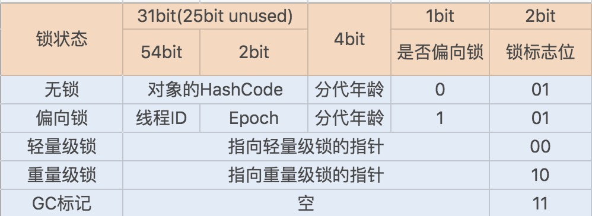
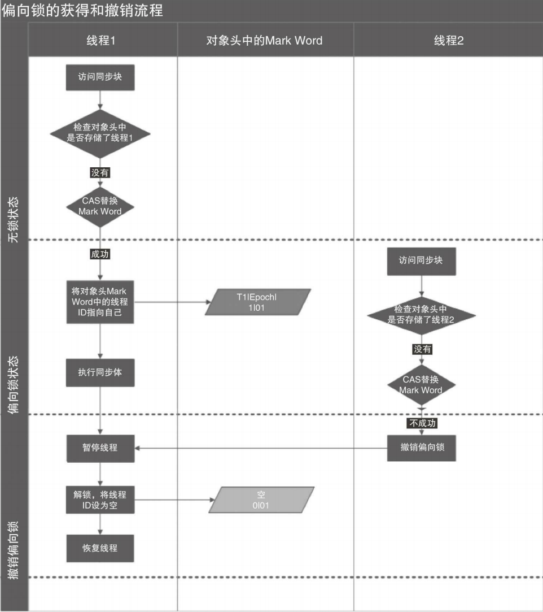
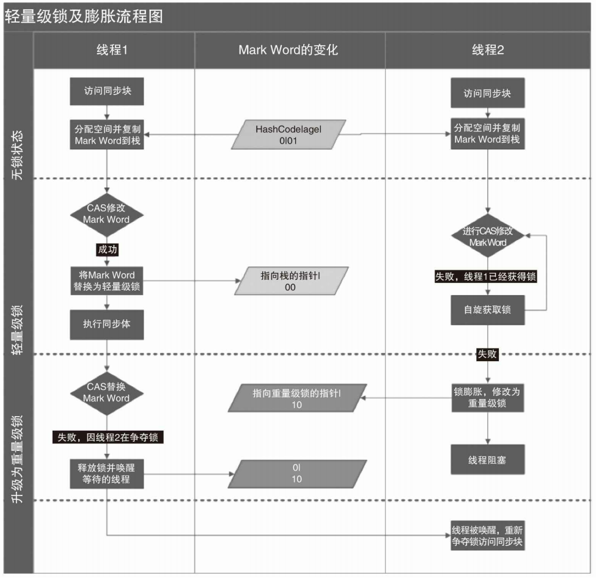

[toc]

# 说说自己对于synchronized关键字的了解

synchronized关键字用于解决多个线程之间访问资源的同步性，**synchronized关键字可以保证被它修饰的方法或者代码块在任意时刻只能有一个线程执行**。

值得注意的是，在Java早期，JDK1.6之前，synchronized属于重量级锁，效率低下。

原因在于：

> 监视器锁【monitor】依赖于底层操作系统的`Mutex Lock`实现，Java的线程是映射到操作系统的原生线程之上的。如果要挂起或唤醒一个线程，都需要操作系统帮忙完成，而**操作系统实现线程之间的切换时需要从用户态转化到内核态，需要消耗比较长的时间**。

但是，JDK1.6之后，Java官方从JVM层面对synchronized关键字进行了较大的优化，效率不可同日而语。主要的优化有：自旋锁、适应性自旋锁、锁消除、锁粗化、偏向锁、轻量级锁等技术来减少锁操作的开销。

# synchronized关键字的三种使用

1. **修饰实例方法：**作用于当前对象实例加锁，进入同步代码前要获得 **当前对象实例的锁**。
2. **修饰静态方法:** 也就是给当前类加锁，会作用于类的所有对象实例 ，进入同步代码前要获得 **当前 class 的锁**。

> 注意：静态成员不属于任何一个实例对象，是类成员！因此，一个线程A调用一个实例对象的非静态synchronized方法，一个线程B调用这个实例对象的所属类的静态synchronized方法，是被允许的。
>
> **因为访问静态 `synchronized` 方法占用的锁是当前类的锁，而访问非静态 `synchronized` 方法占用的锁是当前实例对象锁**。

3. **修饰代码块** ：给括号内配置的对象加锁。`synchronized(this|object)` 表示进入同步代码库前要获得**给定对象的锁**。`synchronized(类.class)` 表示进入同步代码前要获得 **当前 class 的锁**。

# synchronized关键字的底层原理

通过对.class文件反编译可以发现：

- 同步方法通过`ACC_SYNCHRONIZED`修饰。
- 代码块同步使用`monitorenter`和`monitorexit`两个指令实现。

虽然两者实现细节不同，但其实本质上都是JVM基于**进入和退出Monitor对象**来实现同步，JVM的要求如下：

- `monitorenter`指令会在编译后插入到同步代码块的开始位置，而`monitorexit`则会插入到方法结束和异常处。
- 每个对象都有一个`monitor`与之关联，且当一个`monitor`被持有之后，他会处于锁定状态。
- 线程执行到`monitorenter`时，会尝试获取对象对应`monitor`的所有权。
- 在获取锁时，如果对象没被锁定，或者当前线程已经拥有了该对象的锁（可重进入，不会锁死自己），将锁计数器加一，执行`monitorexit`时，锁计数器减一，计数为零则锁释放。
- 获取对象锁失败，**则当前线程陷入阻塞**，直到对象锁被另外一个线程释放。

# JDK1.6之后对synchronized关键字进行的优化

[https://blog.csdn.net/qq_34337272/article/details/108498442](https://blog.csdn.net/qq_34337272/article/details/108498442)

优化：偏向锁，轻量级锁，自旋锁，适应性自旋锁，锁消除，锁粗化。

> 锁主要存在的四种状态，依次是：**无锁状态、偏向锁状态、轻量级锁状态、重量级锁状态**，他们会随着竞争的激烈而逐渐升级。注意**锁可以升级不可降级**，这种策略是为了提高获得锁和释放锁的效率。

## Java对象头的组成

锁存在于Java对象头里，对象头的组成部分：

- Mark Word：存储对象的hashCode或锁信息等。
- Class Metadata Address：存储到对象类型数据的指针。
- Array length：数组的长度（如果当前对象是数组）

> Java对象头又存在于Java堆中，堆内存分为三部分：**对象头**，实例数据和对齐填充。

## MarkWord的组成

Java对象头的MardWord中记录了对象和锁的相关信息，**无锁状态下，Java对象头里的Mark Word里默认存储对象的HashCode、分代年龄和锁标记位**。在64位的JVM中，Mark Word为**64 bit**。

在运行期间Mark Word里存储的数据会随着锁标志位的变化而变化。锁升级的功能也主要靠MarkWord中**锁标志位**和**是否偏向锁标志**完成。

## 锁升级的过程

锁升级的过程：无锁，偏向锁，轻量级锁，重量级锁

## 偏向锁

> HotSpot的作者经过研究发现，大多数情况下，锁不仅不存在多线程竞争，而且总是由同一线程多次获得，为了让线程获得锁的代价更低而引入了偏向锁。

### 偏向锁的适用场景

偏向锁主要用于优化：**同一线程多次申请同一个锁的竞争**，在某些情况下，大部分时间都是同一个线程竞争锁资源的。

### 偏向锁的加锁

主要流程：当一个线程访问同步块并获取锁时，会在对象头和栈帧中的锁记录里**存储锁偏向的线程ID**，以后该线程在进入和退出同步块时**不需要进行CAS操作来加锁和解锁**，只需简单地**测试一下对象头的Mark Word里是否存储着指向当前线程的偏向锁**。

- 如果测试成功，表示线程已经获得了锁。
- 如果测试失败，则需要再测试一下Mark Word中偏向锁的标识是否设置成1（表示当前是偏向锁）：
  - 如果没有设置，则使用CAS竞争锁。
  - 如果设置了，则尝试使用CAS将对象头的偏向锁指向当前线程。

### 偏向锁的撤销

一旦出现其他线程竞争锁资源时，偏向锁就会被**撤销**。偏向锁的撤销**可能需要**等待**全局安全点**【在这个时间点上没有正在执行的字节码】。

- 首先**暂停持有该锁的线程**，然后**检查持有偏向锁的线程是否活着**，如果线程**不处于活动状态**，则将对象头设置成无锁状态。
- 如果持有偏向锁的线程仍然活着，拥有偏向锁的栈会被执行，遍历偏向对象的锁记录，栈中的锁记录和对象头的Mark Word要么重新偏向于其他线程，要么恢复到无锁或者标记对象不适合作为偏向锁，**最后唤醒在暂停的线程**。

### 偏向锁的关闭

偏向锁在Java 6和Java 7里是默认启用的，但是它在应用程序启动几秒钟之后才激活，如有必要可以使用JVM参数来关闭延迟：`-XX:BiasedLockingStartupDelay=0`。

如果锁通常处于竞争状态，可以通过`- XX:-UseBiasedLocking=false`，进入轻量级锁状态。

## 轻量级锁

如偏向锁存在，如有另一线程竞争锁，且对象头MarkWord中的线程ID与当前线程ID不同，则该线程将会**尝试CAS操作获取锁，获取失败，代表锁存在竞争，偏向锁向轻量级锁升级**。

### 轻量级锁的加锁

- 线程在执行同步块之前，JVM会先在当前线程的栈桢中创建用于存储锁记录的空间【Displaced Mark Word】，并**将对象头中的Mark Word复制到锁记录中**。
- 然后线程尝试**使用CAS将对象头中的Mark Word替换为指向锁记录的指针**。
  - 替换成功，则当前线程获得锁。
  - 替换失败，表示其他线程竞争锁，当前线程尝试使用自旋来获取锁。

### 轻量级锁的解锁

- 使用原子的CAS操作将【Displaced Mark Word】替换回对象头。
  - 替换成功，表示没有竞争发生。
  - 替换失败，表示当前锁存在竞争，锁就会膨胀成重量级锁。

### 轻量级锁的适用场景

线程**交替执行**同步块，**绝大部分的锁在整个同步周期内都不存在长时间的竞争**。

## 锁的优缺点对比

| 锁       | 优点                                                         | 缺点                                                   | 适用场景                             |
| -------- | ------------------------------------------------------------ | ------------------------------------------------------ | ------------------------------------ |
| 偏向锁   | 加锁和解锁不需要额外的消耗，和执行非同步方法比仅存在纳秒级的差距。 | 如果线程间存在锁竞争， 会带来额外的锁撤销的消耗。 | 适用于只有一个线程访问同步块场景。   |
| 轻量级锁 | 竞争的线程不会阻塞，提高了程序的响应速度。                   | 如果始终得不到锁竞争的线程使用自旋会消耗CPU。          | 追求响应时间。同步块执行速度非常快。 |
| 重量级锁 | 线程竞争不使用自旋，不会消耗CPU。                            | 线程阻塞，响应时间缓慢。                               | 追求吞吐量。同步块执行速度较长。     |

## 总结

1. JVM在**JDK 1.6**中引入了**分级锁**机制来优化synchronized
2. 当一个线程获取锁时，首先对象锁成为一个偏向锁
   - 这是为了避免在**同一线程重复获取同一把锁**时，**用户态和内核态频繁切换**
3. 如果有多个线程竞争锁资源，锁将会升级为轻量级锁
   - 这适用于在**短时间**内持有锁，且分锁**交替切换**的场景
   - 轻量级锁还结合了**自旋锁**来**避免线程用户态与内核态的频繁切换**
4. 如果锁竞争太激烈（自旋锁失败），同步锁会升级为重量级锁
5. 优化synchronized同步锁的关键：**减少锁竞争**
   - 应该尽量使synchronized同步锁处于**轻量级锁**或**偏向锁**，这样才能提高synchronized同步锁的性能
   - 常用手段
     - **减少锁粒度**：降低锁竞争
     - **减少锁的持有时间**，提高synchronized同步锁在自旋时获取锁资源的成功率，**避免升级为重量级锁**
6. 在**锁竞争激烈**时，可以考虑**禁用偏向锁**和**禁用自旋锁**

# synchronized关键字与ReentrantLock的区别

## 共同点

- 都是可重入锁：自己可以再次获取自己的内部锁【避免一个线程获取锁之后，再次尝试获取锁时造成的死锁】。同一线程每次获取锁，计数器加一，释放锁，计数器减一，计数为0，代表完全释放该锁。

## 不同点

- synchronized依赖于JVM实现，ReentrantLock依赖于API。

- 相比synchronized，ReentrantLock增加了一些高级功能。主要来说主要有三点：

  - **等待可中断** : `ReentrantLock`提供了一种能够中断等待锁的线程的机制，通过 `lock.lockInterruptibly()` 来实现这个机制。也就是说正在等待的线程可以选择放弃等待，改为处理其他事情。
  - **可实现公平锁** : `ReentrantLock`可以指定是公平锁还是非公平锁。而`synchronized`只能是非公平锁。所谓的公平锁就是先等待的线程先获得锁。`ReentrantLock`默认情况是非公平的，可以通过 `ReentrantLock`类的`ReentrantLock(boolean fair)`构造方法来制定是否是公平的。
  - **可实现选择性通知（锁可以绑定多个条件）**: `synchronized`关键字与`wait()`和`notify()`/`notifyAll()`方法相结合可以实现等待/通知机制。`ReentrantLock`类当然也可以实现，但是需要借助于`Condition`接口与`newCondition()`方法。

  

# 参考资料

- [https://snailclimb.gitee.io/javaguide/#/docs/java/Multithread/JavaConcurrencyAdvancedCommonInter](https://snailclimb.gitee.io/javaguide/#/docs/java/Multithread/JavaConcurrencyAdvancedCommonInterviewQuestions?id=11%e8%af%b4%e4%b8%80%e8%af%b4%e8%87%aa%e5%b7%b1%e5%af%b9%e4%ba%8e-synchronized-%e5%85%b3%e9%94%ae%e5%ad%97%e7%9a%84%e4%ba%86%e8%a7%a3)
- http://www.infoq.com/cn/articles/java-se-16-synchronized

- 《Java并发编程的艺术》