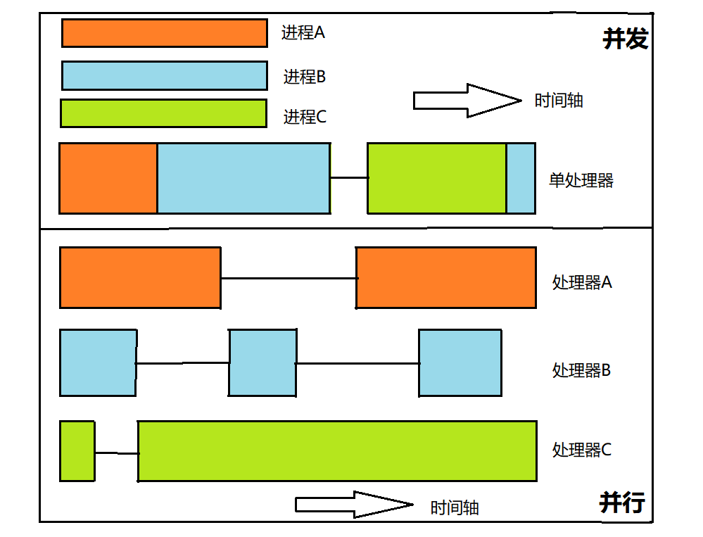

[toc]

# 进程和线程？

## 进程？

- 进程是程序的一次执行过程，是**系统运行程序的基本单位**，进程是动态的。
- 系统运行一个程序就是一个进程从创建，运行到消亡的过程。

Java中，**启动main函数的时候其实就是启动了一个JVM进程**，而main函数所在的线程就是这个进程的主线程。

## 线程？

线程是一个比进程**更小**的执行单位。

一个进程在其执行过程中产生多个线程，**同类的多线程共享进程的堆和方法区资源**，每个线程有自己的程序计数器，虚拟机栈和本地方法栈。

**系统在产生一个线程，或是各个线程之间切换工作时，负担比进程小得多**，因此线程也被称为轻量级进程。

Java程序天生就是多线程程序，可以通过JMX查看一下：

```java
public class Main {

    public static void main(String[] args) {
        // 获取 Java 线程管理 MXBean
        ThreadMXBean threadMXBean = ManagementFactory.getThreadMXBean();
        // 不需要获取同步的 monitor 和 synchronizer 信息，仅获取线程和线程堆栈信息
        ThreadInfo[] threadInfos = threadMXBean.dumpAllThreads(false,false);
        // 遍历线程信息，仅打印线程 ID 和线程名称信息 和 线程状态
        for (ThreadInfo threadInfo : threadInfos) {
            System.out.println("[" + threadInfo.getThreadId() + "]" + threadInfo.getThreadName() + "->" + threadInfo.getThreadState());
        }
    }
    
}
```

输出结果如下：

```java
[6]Monitor Ctrl-Break->RUNNABLE //这是IDEA特有的监控线程
[5]Attach Listener->RUNNABLE //添加事件
[4]Signal Dispatcher->RUNNABLE  // 分发处理给 JVM 信号的线程
[3]Finalizer->WAITING    //清除 reference 线程
[2]Reference Handler->WAITING  //清除 reference 线程
[1]main->RUNNABLE //main线程，程序入口
```

> 一个Java程序得运行是main线程和多个线程同时运行。

# 并发与并行？

- **并发：** 同一时间段，多个任务都在执行 (单位时间内不一定同时执行)；
- **并行：** 单位时间内，多个任务同时执行。



# 从JVM 的角度谈谈进程与线程的关系

> 一个进程可以有多个线程，多个线程共享进程的**堆和方法区**【JDK1.8之后的元空间】的资源，但是每个线程又拥有自己**独立的程序计数器、虚拟机栈和本地方法栈**。

可以得出：

- 线程是进程划分成的更小的运行单位，线程和进程最大的不同在于基本上各进程是独立的，但是各线程不一定，同一进程中的线程极有可能会相互影响。
- 线程执行的开销较小，但不利于资源的管理和保护，而进程恰好相反。

## 为什么程序计数器是私有的？

程序计数器的作用：

- 字节码解释器通过改变程序计数器来依次读取指令，从而实现代码的流程控制，如：顺序执行、选择、循环、异常处理。
- 在多线程的情况下，程序计数器用于记录当前线程执行的位置，从而**当线程被切换回来的时候能够知道该线程上次运行到哪儿了**。

> 需要注意的是，如果执行的是 native 方法，那么程序计数器记录的是 undefined 地址，只有执行的是 Java 代码时程序计数器记录的才是下一条指令的地址。

总结：<u>程序计数器私有主要是为了**线程切换后能恢复到正确的执行位置**。</u>

## 为什么虚拟机栈和本地方法栈是私有的？

- **虚拟机栈：** 每个 Java 方法在执行的同时会创建一个栈帧用于存储局部变量表、操作数栈、常量池引用等信息。从方法调用直至执行完成的过程，就对应着一个栈帧在 Java 虚拟机栈中入栈和出栈的过程。
- **本地方法栈：** 和虚拟机栈所发挥的作用非常相似，区别是： **虚拟机栈为虚拟机执行 Java 方法 （也就是字节码）服务，而本地方法栈则为虚拟机使用到的 Native 方法服务。** 在 HotSpot 虚拟机中和 Java 虚拟机栈合二为一。

总结：<u>虚拟机栈和本地方法栈私有是为了**保证线程中的局部变量不被别的线程访问到**。</u>

## 一句话简单了解堆和方法区

堆和方法区是所有线程共享的资源，其中堆是进程中最大的一块内存，主要用于存放新创建的对象【几乎所有对象都在这里分配内存】，方法区主要用于存放已被加载的类信息、常量、静态变量、即使编译器编译后的代码等数据。

# 为什么使用多线程呢？多线程有啥用？

从**总体**上来说：

- 从计算机底层来说：线程可以比作是轻量级的进程，是程序执行的最小单位,**线程间的切换和调度的成本远远小于进程**。另外，**多核 CPU 时代意味着多个线程可以同时运行**，这减少了线程上下文切换的开销。

- 从当代互联网发展趋势来说：现在的系统动不动就要求百万级甚至千万级的并发量，而多线程并发编程正是开发高并发系统的基础，利用好多线程机制可以**大大提高系统整体的并发能力以及性能**。

深入到计算机底层来探讨：

- 单核时代：在单核时代多线程主要是为了提高 CPU 和 IO 设备的综合利用率。

  - > 当只有一个线程的时候会导致 CPU 计算时，IO 设备空闲；进行 IO 操作时，CPU 空闲。我们可以简单地说这两者的利用率目前都是 50%左右。但是当有两个线程的时候就不一样了，当一个线程执行 CPU 计算时，另外一个线程可以进行 IO 操作，这样两个的利用率就可以在理想情况下达到 100%了。

- 多核时代：多核时代多线程主要是为了提高 CPU 利用率。

  - > 假如我们要计算一个复杂的任务，我们只用一个线程的话，CPU 只会一个 CPU 核心被利用到，而创建多个线程就可以让多个 CPU 核心被利用到，这样就提高了 CPU 的利用率。

# 使用多线程可能会带来哪些问题呢？

- 内存泄漏
- 死锁
- 线程不安全

# 线程的生命周期和状态？

## 六种状态

| 线程状态      | 解释                                                         |
| ------------- | ------------------------------------------------------------ |
| NEW           | 尚未启动的线程状态，即线程创建，**还未调用start方法**        |
| RUNNABLE      | **就绪状态**（调用start，等待调度）+**正在运行**             |
| BLOCKED       | **等待监视器锁**时，陷入阻塞状态                             |
| WAITING       | 等待状态的线程正在**等待**另一线程执行特定的操作（如notify） |
| TIMED_WAITING | 具有**指定等待时间**的等待状态                               |
| TERMINATED    | 线程完成执行，**终止状态**                                   |

## 状态切换


> 注意：join方法是Thread类下的方法，图里写成了Object，应改为`Thread.join`。

线程创建之后它将处于 **NEW（新建）** 状态，调用 `start()` 方法后开始运行，线程这时候处于 **READY（可运行）** 状态。可运行状态的线程获得了 CPU 时间片（timeslice）后就处于 **RUNNING（运行）** 状态。

当线程执行 `wait()`方法之后，线程进入 **WAITING（等待）** 状态。进入等待状态的线程需要依靠其他线程的通知才能够返回到运行状态，而 **TIME_WAITING(超时等待)** 状态相当于在等待状态的基础上增加了超时限制，比如通过 `sleep（long millis）`方法或 `wait（long millis）`方法可以将 Java 线程置于 TIMED WAITING 状态。当超时时间到达后 Java 线程将会返回到 RUNNABLE 状态。当线程调用同步方法时，在没有获取到锁的情况下，线程将会进入到 **BLOCKED（阻塞）** 状态。线程在执行 Runnable 的`run()`方法之后将会进入到 **TERMINATED（终止）** 状态。

# 什么是上下文切换？

多线程编程中一般线程的个数都大于 CPU 核心的个数，而**一个 CPU 核心在任意时刻只能被一个线程使用**，为了让这些线程都能得到有效执行，CPU 采取的策略是为每个线程分配时间片并轮转的形式。当一个线程的时间片用完的时候就会重新处于就绪状态让给其他线程使用，这个过程就属于一次上下文切换。

概括来说就是：当前任务在执行完 CPU 时间片切换到另一个任务之前会先保存自己的状态，以便下次再切换回这个任务时，可以再加载这个任务的状态。**任务从保存到再加载的过程就是一次上下文切换**。

**上下文切换通常是计算密集型的**。也就是说，它需要相当可观的处理器时间，在每秒几十上百次的切换中，每次切换都需要纳秒量级的时间。所以，上下文切换对系统来说意味着消耗大量的 CPU 时间，事实上，可能是操作系统中时间消耗最大的操作。

Linux 相比与其他操作系统（包括其他类 Unix 系统）有很多的优点，其中有一项就是，其上下文切换和模式切换的时间消耗非常少。

# 什么是线程死锁，如何避免死锁？

多个线程同时被阻塞，它们中的一个或者全部都在等待某个资源被释放。

学过操作系统的朋友都知道产生死锁必须具备以下四个条件：

1. **互斥条件**：该资源任意一个时刻只由一个线程占用。
2. **请求与保持条件**：一个进程因请求资源而阻塞时，对已获得的资源保持不放。
3. **不剥夺条件**:线程已获得的资源在末使用完之前不能被其他线程强行剥夺，只有自己使用完毕后才释放资源。
4. **循环等待条件**:若干进程之间形成一种头尾相接的循环等待资源关系。

# 如何避免线程死锁?

我上面说了产生死锁的四个必要条件，为了避免死锁，我们只要破坏产生死锁的四个条件中的其中一个就可以了。现在我们来挨个分析一下：

1. **破坏互斥条件** ：这个条件我们没有办法破坏，因为我们用锁本来就是想让他们互斥的（临界资源需要互斥访问）。
2. **破坏请求与保持条件** ：一次性申请所有的资源。
3. **破坏不剥夺条件** ：占用部分资源的线程进一步申请其他资源时，如果申请不到，可以主动释放它占有的资源。
4. **破坏循环等待条件** ：靠按序申请资源来预防。按某一顺序申请资源，释放资源则反序释放。破坏循环等待条件。

# 说说sleep()方法和wait()方法区别 和共同点？

- 两个最主要的区别在于：sleep方法没有释放锁，而wait()方法释放了锁。
- 两者都可以暂停线程的执行。
- wait通常被用于线程间交互/通信，sleep通常被用于暂停执行。
- wait() 方法被调用后，线程不会自动苏醒，需要别的线程调用同一个对象上的 notify() 或者 notifyAll() 方法。sleep() 方法执行完成后，线程会自动苏醒。或者可以使用 wait(long timeout)超时后线程会自动苏醒。

## 为什么我们调用 start() 方法时会执行 run() 方法，为什么我们不能直接调用 run() 方法？

这是另一个非常经典的 java 多线程面试问题，而且在面试中会经常被问到。很简单，但是很多人都会答不上来！

new 一个 Thread，线程进入了新建状态;调用 start() 方法，会启动一个线程并使线程进入了就绪状态，当分配到时间片后就可以开始运行了。 start() 会执行线程的相应准备工作，然后自动执行 run() 方法的内容，这是真正的多线程工作。 而直接执行 run() 方法，会把 run 方法当成一个 main 线程下的普通方法去执行，并不会在某个线程中执行它，所以这并不是多线程工作。

**总结： 调用 start 方法方可启动线程并使线程进入就绪状态，而 run 方法只是 thread 的一个普通方法调用，还是在主线程里执行。**

# 线程执行完成后如何获取结果


# 参考

- 《Java并发编程的艺术》
- [https://snailclimb.gitee.io/javaguide/#/docs/java/Multithread/JavaConcurrencyBasicsCommonInterviewQuestionsSummary](https://snailclimb.gitee.io/javaguide/#/docs/java/Multithread/JavaConcurrencyBasicsCommonInterviewQuestionsSummary?id=java-%e5%b9%b6%e5%8f%91%e5%9f%ba%e7%a1%80%e5%b8%b8%e8%a7%81%e9%9d%a2%e8%af%95%e9%a2%98%e6%80%bb%e7%bb%93)