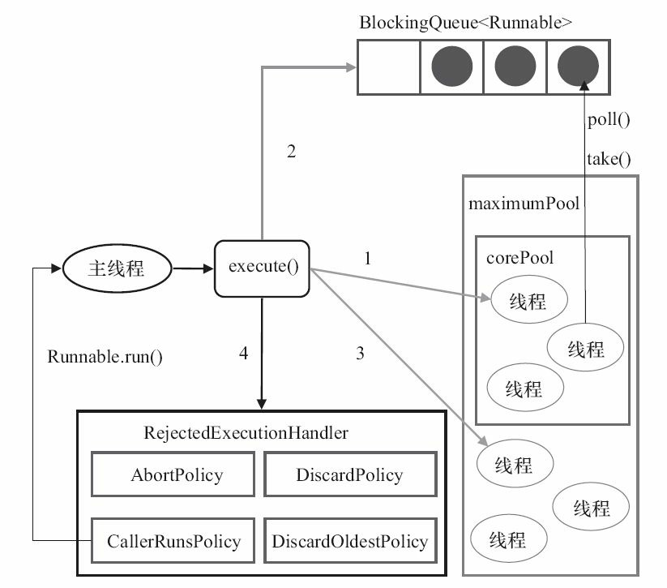

# 为什么要用线程池？

> 池化技术：减少每次获取资源的消耗，提高对资源的利用率。

**线程池**提供了一种限制和管理资源（包括执行一个任务）。 每个**线程池**还维护一些基本统计信息，例如已完成任务的数量。

使用线程池的好处：

- **降低资源消耗**。通过重复利用已创建的线程降低线程创建和销毁造成的消耗。
- **提高响应速度**。当任务到达时，任务可以不需要的等到线程创建就能立即执行。
- **提高线程的可管理性**。线程是稀缺资源，如果无限制的创建，不仅会消耗系统资源，还会降低系统的稳定性，使用线程池可以进行统一的分配，调优和监控。

# 线程池的实现原理？

## execute方法源码

```java
    public void execute(Runnable command) {
        // 如果任务为null，则抛出异常。
        if (command == null)
            throw new NullPointerException();
        // ctl 中保存的线程池当前的一些状态信息  AtomicInteger
        int c = ctl.get();
        //判断当前线程池中执行的任务数量是否小于corePoolSize
        if (workerCountOf(c) < corePoolSize) {
            //如果小于，则通过addWorker新建一个线程，然后，启动该线程从而执行任务。
            if (addWorker(command, true))
                return;
            c = ctl.get();
        }
        //通过 isRunning 方法判断线程池状态
        //线程池处于 RUNNING 状态才会被并且队列可以加入任务
        if (isRunning(c) && workQueue.offer(command)) {
            int recheck = ctl.get();
            // 再次获取线程池状态，如果线程池状态不是 RUNNING 状态就需要从任务队列中移除任务。
            // 并尝试判断线程是否全部执行完毕。同时执行拒绝策略。
            if (! isRunning(recheck) && remove(command))
                reject(command);
            // 如果当前线程池为空就新创建一个线程并执行。
            else if (workerCountOf(recheck) == 0)
                addWorker(null, false);
        }
        //通过addWorker新建一个线程，并将任务(command)添加到该线程中；
        //然后，启动该线程从而执行任务。
        //如果addWorker执行失败，则通过reject()执行相应的拒绝策略的内容。
        else if (!addWorker(command, false))
            reject(command);
    }
```

> 线程池创建线程的时候，会将线程封装成工作线程Worker，Worker在执行完成任务之后，还会循环获取工作队列利的任务来执行。

```java
    final void runWorker(Worker w) {
        Thread wt = Thread.currentThread();
        Runnable task = w.firstTask;
        w.firstTask = null;
        w.unlock(); // allow interrupts
        boolean completedAbruptly = true;
        try {
            while (task != null || (task = getTask()) != null) {//循环执行任务
                w.lock();
                //如果线程池正在停止，确保线程被中断
                if ((runStateAtLeast(ctl.get(), STOP) ||
                     (Thread.interrupted() &&
                      runStateAtLeast(ctl.get(), STOP))) &&
                    !wt.isInterrupted())
                    wt.interrupt();
                try {
                    beforeExecute(wt, task);
                    Throwable thrown = null;
                    try {
                        task.run();
                    } catch (RuntimeException x) {
                        thrown = x; throw x;
                    } catch (Error x) {
                        thrown = x; throw x;
                    } catch (Throwable x) {
                        thrown = x; throw new Error(x);
                    } finally {
                        afterExecute(task, thrown);
                    }
                } finally {
                    task = null;
                    w.completedTasks++;
                    w.unlock();
                }
            }
            completedAbruptly = false;
        } finally {
            processWorkerExit(w, completedAbruptly);
        }
    }
```


1. 线程池判断**核心线程池**【corePoolSize】里的线程是否都在执行任务。如果不是，则创建一个新的工作线程来执行任务。如果核心线程池里的线程都在执行任务，则进入下个流程。
2. 线程池判断**工作队列**【BlockingQueue】是否已经满。如果工作队列没有满，则将新提交的任务存储在这个工作队列里。如果工作队列满了，则进入下个流程。 
3. 线程池判断**线程池**【maximumPoolSize】的线程是否都处于工作状态。如果没有，则创建一个新的工作线程来执行任务。如果已经满了，则交给**饱和策略**【RejectedExecutionHandler.rejectedExecution()】来处理这个任务。 



# ThreadPoolExecutor重要分析

## 构造方法的重要参数

ThreadPoolExecutor方法的构造参数有很多，我们看看最长的那个就可以了：

```java
    public ThreadPoolExecutor(int corePoolSize,
                              int maximumPoolSize,
                              long keepAliveTime,
                              TimeUnit unit,
                              BlockingQueue<Runnable> workQueue,
                              ThreadFactory threadFactory,
                              RejectedExecutionHandler handler) {
        if (corePoolSize < 0 ||
            maximumPoolSize <= 0 ||
            maximumPoolSize < corePoolSize ||
            keepAliveTime < 0)
            throw new IllegalArgumentException();
        if (workQueue == null || threadFactory == null || handler == null)
            throw new NullPointerException();
        this.acc = System.getSecurityManager() == null ?
                null :
                AccessController.getContext();
        this.corePoolSize = corePoolSize;
        this.maximumPoolSize = maximumPoolSize;
        this.workQueue = workQueue;
        this.keepAliveTime = unit.toNanos(keepAliveTime);
        this.threadFactory = threadFactory;
        this.handler = handler;
    }
```

- `corePoolSize`：核心线程数定义了**最小可以同时运行的线程数量**。
- `maximumPoolSize`：**当队列中存放的任务达到队列容量的时候**，当前可以同时运行的线程数量变为**最大线程数**。【如果使用的无界队列，这个参数就没啥效果】
- `workQueue`: 当新任务来的时候会先判断当前运行的线程数量是否达到核心线程数，**如果达到核心线程数的话，新任务就会被存放在队列中**。
- `keepAliveTime`:当线程池中的线程数量大于 `corePoolSize` 的时候，如果这时没有新的任务提交，核心线程外的线程不会立即销毁，而是会等待，直到等待的时间超过了 `keepAliveTime`才会被回收销毁。
- `unit`：`keepAliveTime` 的时间单位。
- `threadFactory`：用于设置创建线程的工厂，可以通过线程工厂给每个创建出来的线程设置更有意义的名字。
- `handler`：饱和策略，当前同时运行的线程数量达到最大线程数量【`maximumPoolSize`】并且队列也已经被放满时，执行饱和策略。

# 任务队列有哪些？

- ArrayBlockingQueue：基于数组结构的有界阻塞队列，按FIFO原则对元素进行排序。
- LinkedBlockingQueue：基于链表结构的阻塞队列，按FIFO排序元素，吞吐量通常要高于ArrayBlockingQueue，`Executors.newFixedThreadPool()`就是使用了这个队列。
- SynchronousQueue：一个不存储元素的阻塞队列，每个插入操作必须等到另一个线程调用移除操作，否则插入操作一直处于阻塞状态，吞吐量通常要高于LinkedBlockingQueue，

# 饱和策略有哪些呢？

- **`ThreadPoolExecutor.AbortPolicy`**：抛出 `RejectedExecutionException`来拒绝新任务的处理。【默认的饱和策略】

- **`ThreadPoolExecutor.CallerRunsPolicy`**【提供可伸缩队列】：调用执行自己的线程运行任务，也就是直接在调用`execute`方法的线程中运行(`run`)被拒绝的任务，**如果执行程序已关闭，则会丢弃该任务**。因此这种策略会降低对于新任务提交速度，影响程序的整体性能。如果您的应用程序可以承受此延迟并且你要求任何一个任务请求都要被执行的话，你可以选择这个策略。

  ```java
  public void rejectedExecution(Runnable r, ThreadPoolExecutor e) {
      if (!e.isShutdown()) {
          r.run();
      }
  }
  ```

- **`ThreadPoolExecutor.DiscardPolicy`：** 不处理新任务，直接丢弃掉。

- **`ThreadPoolExecutor.DiscardOldestPolicy`：** 此策略将丢弃最早的未处理的任务请求，并执行当前任务。

  ```java
  public void rejectedExecution(Runnable r, ThreadPoolExecutor e) {
      if (!e.isShutdown()) {
          e.getQueue().poll();
          e.execute(r);
      }
  }
  ```

当然，也可以根据需要自定义拒绝策略，需要实现`RejectedExecutionHandler`。

# 如何创建线程池？

一、使用ThreadPoolExecutor的各种构造方法。

二、通过Executor框架的工具类Executors可以创建三种类型的ThreadPoolExecutor。

《阿里巴巴 Java 开发手册》中**强制线程池不允许使用 Executors 去创建，而是通过 ThreadPoolExecutor 的方式**，这样的处理方式让写的同学更加明确线程池的运行规则，规避资源耗尽的风险

> Executors 返回线程池对象的弊端如下：
>
> - **FixedThreadPool 和 SingleThreadExecutor** ： 允许请求的队列长度为 Integer.MAX_VALUE ，可能堆积大量的请求，从而导致 OOM。
> - **CachedThreadPool 和 ScheduledThreadPool** ： 允许创建的线程数量为 Integer.MAX_VALUE ，可能会创建大量线程，从而导致 OOM。


# 执行execute方法和submit方法的区别？

1. **`execute()`方法用于提交不需要返回值的任务，所以无法判断任务是否被线程池执行成功与否；**
2. **`submit()`方法用于提交需要返回值的任务。线程池会返回一个 `Future` 类型的对象，通过这个 `Future` 对象可以判断任务是否执行成功**，并且可以通过 `Future` 的 `get()`方法来获取返回值，`get()`方法会阻塞当前线程直到任务完成，而使用 `get（long timeout，TimeUnit unit）`方法则会阻塞当前线程一段时间后立即返回，这时候有可能任务没有执行完。


