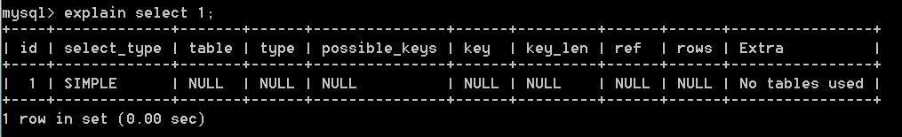

```mysql
explain select 1;
```



| 列名          | 描述                                                   |
| ------------- | ------------------------------------------------------ |
| id            | 在一个大的查询语句中每个select关键字都对应一个唯一的id |
| select_type   | select关键字对应的那个查询的类型                       |
| table         | 表名                                                   |
| type          | 针对单表的访问方法                                     |
| possible_keys | 可能用到的索引                                         |
| key_len       | 实际使用到的索引长度                                   |
| ref           | 当使用索引列等值查询时，与索引列进行等值匹配的对象信息 |
| rows          | 预估的需要读取的记录条数                               |
| Extra         | 一些额外的信息                                         |

