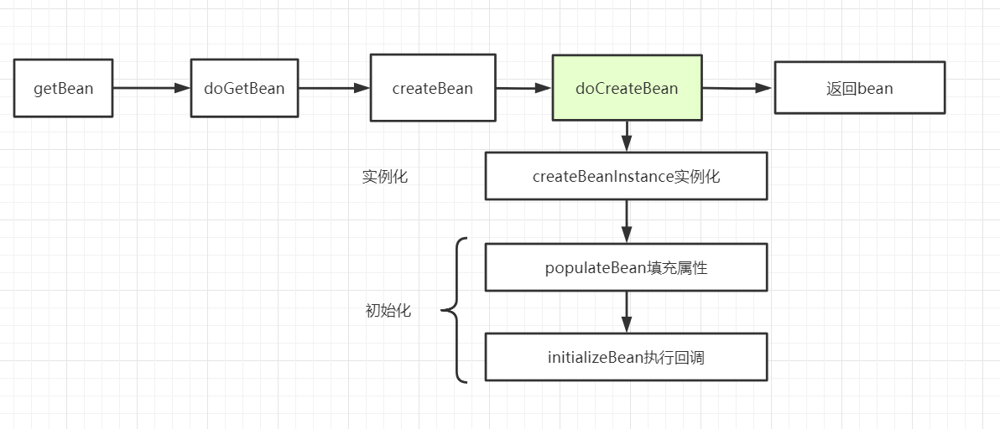
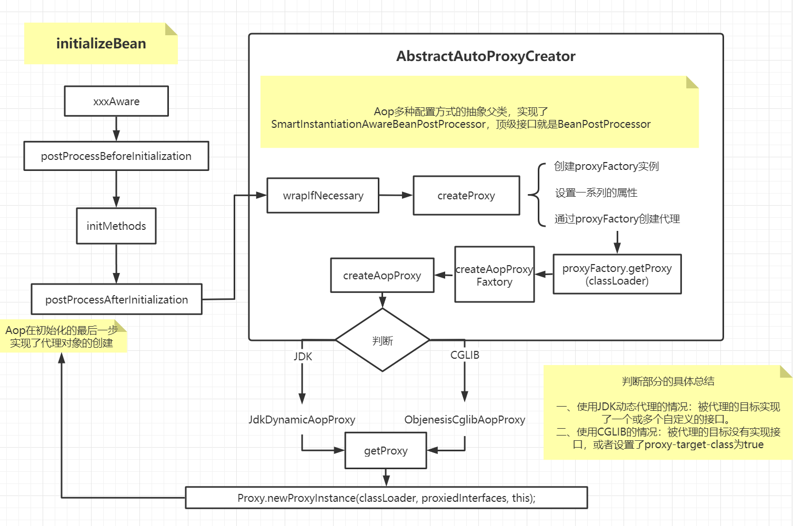

本文是对近期学习知识的一个总结，附带源码注释及流程图，如有不足之处，还望评论区批评指正。

[toc]

此处感谢javadoop的源码解析，收益匪浅：[https://javadoop.com/post/spring-aop-intro](https://javadoop.com/post/spring-aop-intro)

# 一、AOP、SpringAOP、AspectJ的区别

AOP为`Aspect Oriented Programming`的缩写，意为：**面向切面编程**，通过**预编译方式和运行期间动态代理**实现程序功能的统一维护的一种技术。利用AOP可以**对业务逻辑的各个部分进行隔离**，从而使得业务逻辑各部分之间的耦合度降低，提高程序的可重用性，同时提高了开发的效率。

文绉绉的，没用过确实很懵，但是用过之后，不说清晰，起码有内意思了。

关于SpringAOP和AspectJ，参考Javadoop老师的解释：[https://javadoop.com/post/spring-aop-intro](https://javadoop.com/post/spring-aop-intro)

> **Spring AOP：**
>
> - 它基于动态代理来实现。默认地，如果使用接口的，用 JDK 提供的动态代理实现，如果没有接口，使用 CGLIB 实现。大家一定要明白背后的意思，包括什么时候会不用 JDK 提供的动态代理，而用 CGLIB 实现。
> - Spring 3.2 以后，spring-core 直接就把 CGLIB 和 ASM 的源码包括进来了，这也是为什么我们不需要显式引入这两个依赖
> - Spring 的 IOC 容器和 AOP 都很重要，Spring AOP 需要依赖于 IOC 容器来管理。
> - 如果你是 web 开发者，有些时候，你可能需要的是一个 Filter 或一个 Interceptor，而不一定是 AOP。
> - Spring AOP 只能作用于 Spring 容器中的 Bean，它是使用纯粹的 Java 代码实现的，只能作用于 bean 的方法。
> - Spring 提供了 AspectJ 的支持，后面我们会单独介绍怎么使用，一般来说我们用**纯的** Spring AOP 就够了。
> - 很多人会对比 Spring AOP 和 AspectJ 的性能，Spring AOP 是基于代理实现的，在容器启动的时候需要生成代理实例，在方法调用上也会增加栈的深度，使得 Spring AOP 的性能不如 AspectJ 那么好。
>
> **AspectJ：**
>
> - AspectJ 出身也是名门，来自于 Eclipse 基金会，link：https://www.eclipse.org/aspectj
>
> - 属于静态织入，它是通过修改代码来实现的，它的织入时机可以是：
>   - Compile-time weaving：编译期织入，如类 A 使用 AspectJ 添加了一个属性，类 B 引用了它，这个场景就需要编译期的时候就进行织入，否则没法编译类 B。
>   - Post-compile weaving：也就是已经生成了 .class 文件，或已经打成 jar 包了，这种情况我们需要增强处理的话，就要用到编译后织入。
>   - **Load-time weaving**：指的是在加载类的时候进行织入，要实现这个时期的织入，有几种常见的方法。1、自定义类加载器来干这个，这个应该是最容易想到的办法，在被织入类加载到 JVM 前去对它进行加载，这样就可以在加载的时候定义行为了。2、在 JVM 启动的时候指定 AspectJ 提供的 agent：`-javaagent:xxx/xxx/aspectjweaver.jar`。
>
> - AspectJ 能干很多 Spring AOP 干不了的事情，它是 **AOP 编程的完全解决方案**。Spring AOP 致力于解决的是企业级开发中最普遍的 AOP 需求（方法织入），而不是力求成为一个像 AspectJ 一样的 AOP 编程完全解决方案。
> - 因为 AspectJ 在实际代码运行前完成了织入，所以大家会说它生成的类是没有额外运行时开销的。

# 二、AOP关键术语


- 切面（Aspect）：也就是我们定义的专注于提供辅助功能的模块，比如安全管理，日志信息等。
- 连接点（JoinPoint）：切面代码可以通过连接点切入到正常业务之中，图中每个方法的每个点都是连接点。
- 切入点（PointCut）：一个切面不需要通知所有的连接点，而**在连接点的基础之上增加切入的规则**，选择需要增强的点，最终真正通知的点就是切入点。
- 通知方法（Advice）：就是切面需要执行的工作，主要有五种通知：before，after，afterReturning，afterThrowing，around。
- 织入（Weaving）：将切面应用到目标对象并创建代理对象的过程，SpringAOP选择再目标对象的运行期动态创建代理对

- 引入（introduction）：在不修改代码的前提下，引入可以在运行期为类动态地添加方法或字段。

# 三、通知的五种类型

- 前置通知Before：目标方法调用之前执行的通知。
- 后置通知After：目标方法完成之后，无论如何都会执行的通知。
- 返回通知AfterReturning：目标方法成功之后调用的通知。
- 异常通知AfterThrowing：目标方法抛出异常之后调用的通知。
- 环绕通知Around：可以看作前面四种通知的综合。

# 四、切入点表达式

上面提到：连接点增加切入规则就相当于定义了切入点，当然切入点表达式分为两种：within和execution，这里主要学习execution表达式。

- 写法：execution(访问修饰符 返回值 包名.包名……类名.方法名(参数列表))
- 例：`execution(public void com.smday.service.impl.AccountServiceImpl.saveAccount())`
- 访问修饰符可以省略，返回值可以使用通配符*匹配。
- 包名也可以使用`*`匹配，数量代表包的层级，当前包可以使用`..`标识，例如`* *..AccountServiceImpl.saveAccount()`
- 类名和方法名也都可以使用`*`匹配：`* *..*.*()`
- 参数列表使用`..`可以标识有无参数均可，且参数可为任意类型。

> 全通配写法：* *…*.*(…)

通常情况下，切入点应当设置再业务层实现类下的所有方法：`* com.smday.service.impl.*.*(..)`。

# 五、AOP应用场景

- 记录日志
- 监控性能
- 权限控制
- 事务管理

# 六、AOP源码分析

## SpringBean的生命周期

写了好多篇文章，每次都要来回顾一下SpringBean的生命周期，可见它真的十分重要。

- Spring的完整生命周期。
- Spring解决循环依赖，对实例化之后，初始化之前动了手脚。

Spring的Aop又是在哪完成的对目标对象的代理呢？我们大概也能够想到，其实就是在执行回调的时候。按照惯例，先复习一下，从getBean开始到返回Bean经历了什么：




## Aop的流程总结

以注解方式`@EnableAspectJAutoProxy`配置Aop开启@Aspectj为例，其实是通过这个注解注入了一个`AnnotationAwareAspectJAutoProxyCreator`，但通过源码可以发现，这个类中其实并没有重写`postProcessAfterInitialization()`，最终实现其实是在`AbstractAutoProxyCreator`中。

具体干的事情，我已经通过一张图总结出来了，如果想要了解更加具体的信息，不妨打开源码，可以看的更加清晰一些。




### AnnotationAwareAspectJAutoProxyCreator的注册

首先是对`AnnotationAwareAspectJAutoProxyCreator`的注册环节：【在此不作赘述】

```java
class AspectJAutoProxyBeanDefinitionParser implements BeanDefinitionParser {

    @Override
    @Nullable
     // 1. 注册proxy creator
    public BeanDefinition parse(Element element, ParserContext parserContext) { 
   AopNamespaceUtils.registerAspectJAnnotationAutoProxyCreatorIfNecessary(parserContext, element);
        extendBeanDefinition(element, parserContext);
        return null;
    }

}
```

### applyBeanPostProcessorsAfterInitialization入口

AbstractAutowireCapableBeanFactory.java

```java
protected Object initializeBean(String beanName, Object bean, @Nullable RootBeanDefinition mbd) {//属性注入完成,处理各种回调
    invokeAwareMethods(beanName, bean);//如果bean实现了BeanNameAware、BeanClassLoaderAware、BeanFactoryAware接口, 回调


    Object wrappedBean = bean;
    if (mbd == null || !mbd.isSynthetic()) { //aop在init-method之前并没有进行操作, 目前还是原来那个对象
        wrappedBean = applyBeanPostProcessorsBeforeInitialization(wrappedBean, beanName);//BeanPostProcessor 的 postProcessBeforeInitialization 回调
    }

    invokeInitMethods(beanName, wrappedBean, mbd);//处理bean中定义的init-method或 bean实现了InitializingBean ,调用afterPropertiesSet() 方法

    if (mbd == null || !mbd.isSynthetic()) {
        wrappedBean = applyBeanPostProcessorsAfterInitialization(wrappedBean, beanName);//BeanPostProcessor 的 postProcessAfterInitialization 回调 注意这里！
    }
    return wrappedBean;
}
```

```java
@Override
public Object applyBeanPostProcessorsAfterInitialization(Object existingBean, String beanName)
    throws BeansException {

    Object result = existingBean;
    for (BeanPostProcessor processor : getBeanPostProcessors()) {
        Object current = processor.postProcessAfterInitialization(result, beanName);//AnnotationAwareAspectJAutoProxyCreator
        if (current == null) {
            return result;
        }
        result = current;
    }
    return result;//返回[可能代理后的]结果
}
```

### AbstractAutoProxyCreator的主要方法

```java
//SpringAop在IOC容器创建bean实例的最后对bean进行处理,进行代理增强, AbstractAutoProxyCreato	
@Override 
public Object postProcessAfterInitialization(@Nullable Object bean, String beanName) {
    if (bean != null) {
        Object cacheKey = getCacheKey(bean.getClass(), beanName);
        if (this.earlyProxyReferences.remove(cacheKey) != bean) {
            return wrapIfNecessary(bean, beanName, cacheKey);//这个方法将返回代理类
        }
    }
    return bean;
}
```

```java
protected Object wrapIfNecessary(Object bean, String beanName, Object cacheKey) {

    //返回匹配当前bean 的所有的advisor, advice, interceptor
    Object[] specificInterceptors = getAdvicesAndAdvisorsForBean(bean.getClass(), beanName, null);
    if (specificInterceptors != DO_NOT_PROXY) {
        this.advisedBeans.put(cacheKey, Boolean.TRUE);
        //在这里创建代理
        Object proxy = createProxy(
            bean.getClass(), beanName, specificInterceptors, new SingletonTargetSource(bean));
        this.proxyTypes.put(cacheKey, proxy.getClass());
        return proxy;
    }

    this.advisedBeans.put(cacheKey, Boolean.FALSE);
    return bean;
}
```

### createProxy过程

```java
protected Object createProxy(Class<?> beanClass, @Nullable String beanName,
@Nullable Object[] specificInterceptors, TargetSource targetSource) {

	//创建ProxyFactory实例
    ProxyFactory proxyFactory = new ProxyFactory();
    proxyFactory.copyFrom(this);
	//在schema-based配置方式里,可以将 proxy-target-class="true",这样不管有没有接口都使用cglib
    if (!proxyFactory.isProxyTargetClass()) {
        if (shouldProxyTargetClass(beanClass, beanName)) {
            proxyFactory.setProxyTargetClass(true);
        }
        else {
            evaluateProxyInterfaces(beanClass, proxyFactory);
        }
    }
	//返回当前bean的advisors数组
    Advisor[] advisors = buildAdvisors(beanName, specificInterceptors);
    proxyFactory.addAdvisors(advisors); //设置advisors数组
    proxyFactory.setTargetSource(targetSource);//targetSource 携带了真实实现的信息
    customizeProxyFactory(proxyFactory);

    proxyFactory.setFrozen(this.freezeProxy);
    if (advisorsPreFiltered()) {
        proxyFactory.setPreFiltered(true);
    }

    return proxyFactory.getProxy(getProxyClassLoader());//getProxy(getProxyClassLoader())这一步创建代理
}
```

### JDK动态代理和CGLIB动态代理何时使用

这一步产生分歧的地方在ProxyFactory的getProxy方法，在getProxy之前，首先需要执行createAopProxy，而createAopProxy方法又被这个AopProxyFactory调用：

```java
protected final synchronized AopProxy createAopProxy() {
    if (!this.active) {
        activate();
    }
    //创建AopProxy之前,需要一个AopProxyFactory
    return getAopProxyFactory().createAopProxy(this);
}

// ProxyCreatorSupport
//这个aopProxyFactory用于创建aopProxy, 之后可以用aopProxy.getProxy(classLoader)创建代理
public ProxyCreatorSupport() {
    this.aopProxyFactory = new DefaultAopProxyFactory();
}
```

也就是最后会走到DefaultAopProxyFactory中

```java

@Override
public AopProxy createAopProxy(AdvisedSupport config) throws AopConfigException {
    
    if (!IN_NATIVE_IMAGE && 
        (config.isOptimize() || config.isProxyTargetClass() || hasNoUserSuppliedProxyInterfaces(config))) {
        Class<?> targetClass = config.getTargetClass();
        if (targetClass == null) {
            throw new AopConfigException();
        }
        //如果要代理的类本身就是接口,使用JDK动态代理
        if (targetClass.isInterface() || Proxy.isProxyClass(targetClass)) {
            return new JdkDynamicAopProxy(config);
        }
        //jdk动态代理基于接口,只有接口中的方法才会被增强, cglib基于类继承,如果方法使用了final或者private修饰,也不能增强
        return new ObjenesisCglibAopProxy(config);
    }
    else {
        // 如果有接口，会跑到这个分支
        return new JdkDynamicAopProxy(config);
    }
}
```

总结：

- 如果被代理的目标实现了一个或多个自定义的接口，那么就会使用JDK动态代理。

- 如果没有实现任何接口，则使用CGLIB实现代理。

- 如果设置`proxy-target-class=true `或` <property name="proxyTargetClass" value="true"/>`则不管有没有实现接口都会使用CGLIB。

# 七、JDK动态代理的实现

最终的最终，都会走到真正创建代理对象的流程上：

```java
@Override
public Object getProxy(@Nullable ClassLoader classLoader) {
	//获取代理接口
    Class<?>[] proxiedInterfaces = AopProxyUtils.completeProxiedInterfaces(this.advised, true);
    //查找代理目标的接口是否定义equals和hashcode方法
    findDefinedEqualsAndHashCodeMethods(proxiedInterfaces);
    //使用jdk动态代理创建代理对象
    return Proxy.newProxyInstance(classLoader, proxiedInterfaces, this);
}
```

第一个参数：classLoader。

第二个参数：实现的接口。

第三个参数：InvocationHandler实例。

而本身JdkDynamicAopProxy本就实现了InvocationHandler，因此传入this。至此，当调用被代理类的方法的时候，都会最终调用代理类实现的invoke方法，在这个方法中定义横切的逻辑。

```java
public interface InvocationHandler {
    public Object invoke(Object proxy, Method method, Object[] args)
        throws Throwable;
}
```

- proxy：代理对象的引用。
- method：当前执行的方法。
- args：当前执行方法所需的参数。
- return：和被代理对象有相同的返回值。

```java
@Override
@Nullable
public Object invoke(Object proxy, Method method, Object[] args) throws Throwable { 	//当生成的代理类对外提供服务的时候,都会导入到这个invoke方法中
    Object oldProxy = null;
    boolean setProxyContext = false;
	
    TargetSource targetSource = this.advised.targetSource;
    Object target = null;

    try {
        if (!this.equalsDefined && AopUtils.isEqualsMethod(method)) {
            // 对equals方法的代理
            return equals(args[0]);
        }
        else if (!this.hashCodeDefined && AopUtils.isHashCodeMethod(method)) {
            //对hashCode()方法的代理
            return hashCode();
        }
        //...

        Object retVal;
		//如果设置了exposeProxy,将proxy放入ThreadLocal中
        if (this.advised.exposeProxy) { 
            oldProxy = AopContext.setCurrentProxy(proxy);
            setProxyContext = true;
        }

        // Get as late as possible to minimize the time we "own" the target,
        // in case it comes from a pool.
        target = targetSource.getTarget();
        Class<?> targetClass = (target != null ? target.getClass() : null);

        // 获取目标方法的拦截链，包含所有要执行的 advice
        List<Object> chain = this.advised.getInterceptorsAndDynamicInterceptionAdvice(method, targetClass);

        // 检查一下这个链上是不是有advice，如果没有的话，可以跳过创建MethodInvocation
        if (chain.isEmpty()) { //chain如果是空的,表示不需要被增强，直接调用目标方法
            Object[] argsToUse = AopProxyUtils.adaptArgumentsIfNecessary(method, args);
            retVal = AopUtils.invokeJoinpointUsingReflection(target, method, argsToUse);
        }
        else {
            // 如果chain里有advice 执行方法,得到返回值
            MethodInvocation invocation =
                new ReflectiveMethodInvocation(proxy, target, method, args, targetClass, chain);
            //沿着拦截器链，执行通知
            retVal = invocation.proceed();
        }

        // 对返回值的处理
        Class<?> returnType = method.getReturnType();
        if (retVal != null && retVal == target &&
            returnType != Object.class && returnType.isInstance(proxy) &&
            !RawTargetAccess.class.isAssignableFrom(method.getDeclaringClass())) {
            retVal = proxy;
        }
        else if (retVal == null && returnType != Void.TYPE && returnType.isPrimitive()) {
            throw new AopInvocationException();
        }
        return retVal;
    }
    finally {
        if (target != null && !targetSource.isStatic()) {
            // 释放目标对象
            targetSource.releaseTarget(target);
        }
        if (setProxyContext) {
            // 存储代理对象
            AopContext.setCurrentProxy(oldProxy);
        }
    }
}

```

# 八、总结

> 以@AspectJ注解方式为例

- 首先，依据`<aop:aspectj-autoproxy>`或`@EnableAspectJAutoProxy`，Spring会在容器启动的时候注册名叫`internalAutoProxyCreator`的`AnnotationAwareAspectJAutoProxyCreator `。
- 在bean实例化完成，属性装配完成之后，开始执行回调方法，这时取出所有的BeanPostProcessor，执行其postProcessAfterInitialization方法，准备开始对目标对象代理的创建。
- 首先创建一个代理工厂ProxyFactory，设置一系列的属性，如所有的通知方法，增强器，拦截器和目标类等注入代理工厂，再调用ProxyFactory.getProxy(classLoader)获取代理。
- 通过判断是用JDK动态代理还是CGLIB创建不同的AopProxy，最后获取getProxy。

> 参考资料
>
> - [https://www.cnblogs.com/aobing/p/12849591.html](https://www.cnblogs.com/aobing/p/12849591.html)
> - [https://javadoop.com/post/spring-aop-source](https://javadoop.com/post/spring-aop-source)