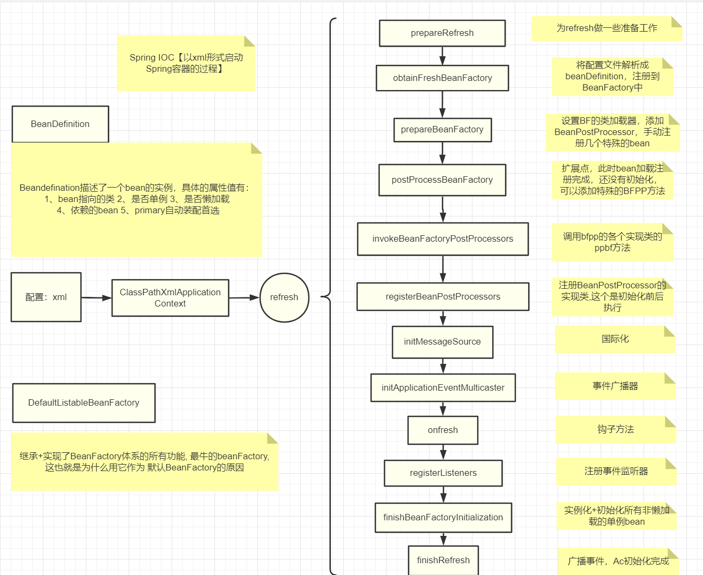
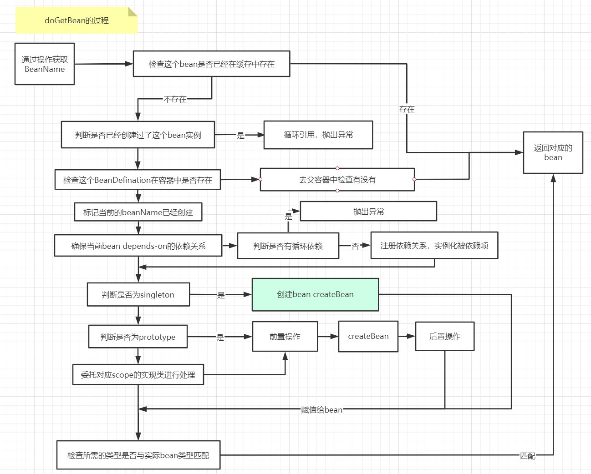

如果对SpringIoc与Aop的源码感兴趣，可以访问参考：[https://javadoop.com/](https://javadoop.com/)，十分详细。

[toc]

# Spring容器的启动全流程

Spring容器的启动流程如下，这是我在看源码过程中自己总结的流程图，如有错误，还望评论区指点：



接下来附上源码：

> 为什么是refresh方法命名，而不是init命名呢？
>
>  其实，在ApplicaitonContext建立起来之后，可以通过refresh进行重建，将原来的ac销毁，重新执行一次初始化操作，用refresh更加贴切。

```java
public ClassPathXmlApplicationContext(
    String[] configLocations, boolean refresh, @Nullable ApplicationContext parent)
    throws BeansException {
    //如果已经有application Context ,并需要配置成父子关系, 调用该构造方法
    super(parent);
    // 根据提供的路径，处理成配置文件数组(以分号、逗号、空格、tab、换行符分割)
    setConfigLocations(configLocations);
    if (refresh) {
        refresh();//核心!!!
    }

}
```

虽然`ApplicationContext`继承自`BeanFactory`，更确切地说是`ApplicationContext`内部持有了一个实例化的`BeanFactory(DefaultListableBeanFactory)`，`BeanFactory`的相关操作其实是委托给这个实例来处理。

```java
@Override
public void refresh() throws BeansException, IllegalStateException {
    //保证容器启动销毁操作的并发安全
    synchronized (this.startupShutdownMonitor) {
        //准备工作, 记录容器的启动时间, 标记已启动状态, 处理配置文件种的占位符
        prepareRefresh();

        //这步用于将配置文件解析成一个个bean definition,注册到重建的beanFactory中,(只是提取了配置信息,bean并没有初始化)，同时还设置两个配置属性：1、是否允许bean覆盖2、是否允许循环引用
        ConfigurableListableBeanFactory beanFactory = obtainFreshBeanFactory();

        //设置beanFactory的类加载器, 添加几个beanPostProcessor ,手动注册几个特殊的bean
        prepareBeanFactory(beanFactory);
        try {
            //如果bean实现了beanFactoryPostProcessor 将会执行postProcessBeanFactory方法  提供子类的扩展点,到这bean都加载、注册完成,但没有初始化,具体的子类可以在这步添加特殊bfpp实现类做事
            postProcessBeanFactory(beanFactory);

            //调用bfpp的各个实现类的ppbf方法
            invokeBeanFactoryPostProcessors(beanFactory);

            //注册BeanPostProcessor的实现类,BeanPostProcessor将在bean初始化前后执行
            registerBeanPostProcessors(beanFactory);

            //初始化当前 ApplicationContext 的 MessageSource，国际化
            initMessageSource();

            //初始化当前 ApplicationContext 的事件广播器
            initApplicationEventMulticaster();

            //模板方法(钩子方法，具体的子类可以在这里初始化一些特殊的 Bean（在初始化 singleton beans 之前）
            onRefresh();

            //注册事件监听器，监听器需要实现 ApplicationListener 接口。
            registerListeners();

            //实例化+初始化所有的非懒加载的单例bean
            finishBeanFactoryInitialization(beanFactory);

            //广播事件，ApplicationContext 初始化完成
            finishRefresh();
        }

        catch (BeansException ex) {
            // Destroy already created singletons to avoid dangling resources.销毁已经初始化的 singleton 的 Beans，以免有些 bean 会一直占用资源
            destroyBeans();
            cancelRefresh(ex);
            // Propagate exception to caller.
            throw ex;
        }
        finally {
            resetCommonCaches();
        }
    }
}
```


利用注解方式大致也是按照这个流程一步步下来，不同在于，AnnotationConfigApplicationContext在执行构造器的时候，已经通过`scan(basePackages);`将beanDefination读取到。

> 将bean的定义转化为BeanDefination：

如果利用AnnotationConfigApplicationContext。

```java
	public AnnotationConfigApplicationContext(String... basePackages) {
		this();
		scan(basePackages);//这个过程中配置已经被转化为一个个的beanDefinition
		refresh();
	}
```

# Spring容器关闭流程

```java
protected void doClose() {
    if (this.active.get() && this.closed.compareAndSet(false, true)) {
        if (logger.isDebugEnabled()) {
            logger.debug("Closing " + this);
        }
		//取消注册上下文
        if (!IN_NATIVE_IMAGE) {
            LiveBeansView.unregisterApplicationContext(this);
        }
        // 发布事件
        publishEvent(new ContextClosedEvent(this));

        // 停止所有Lifecycle bean，以避免在销毁期间造成延迟。
        if (this.lifecycleProcessor != null) {
            this.lifecycleProcessor.onClose();
        }

        // 销毁上下文的BeanFactory中所有缓存的单例。
        destroyBeans();

        // 关闭此上下文本身的状态。
        closeBeanFactory();

        // 让子类善后
        onClose();

        // 充值本地应用坚硬其为pre-refresh状态
        if (this.earlyApplicationListeners != null) {
            this.applicationListeners.clear();
            this.applicationListeners.addAll(this.earlyApplicationListeners);
        }

        // 切换为非活动状态
        this.active.set(false);
    }
}
```

大概就是：先发布事件，再摧毁Factory中的bean，再摧毁Factory本身，最后设置一些状态。

而Bean周期中的销毁部分就存在于`destroyBeans`中。当然，销毁bean也是需要先销毁它所依赖的bean。

# Bean 的生命周期


在了解Bean的生命周期之前，我们必须要明确SpringBean和我们通常说的对象有什么区别？

> SpringBean是**由SpringIoC容器管理**的，是一个**被实例化，组装，并通过容器管理的对象**，可通过getBean()获取。**容器通过读取配置的元数据，解析成BeanDefinition，注册到BeanFactory中，加入到singletonObjects缓存池中**。

## Bean的创建

在上面的流程中，只有到`finishBeanFactoryInitialization(beanFactory);`这一步，才开始对非懒加载实例的实例化+ 初始化。

```java
//实例化所有剩余的非懒加载的单例bean
beanFactory.preInstantiateSingletons();
```

可以看一下这一步的具体实现：DefaultListableBeanFactory

```java
public void preInstantiateSingletons() throws BeansException {
    //拥有所有的beanNames
    List<String> beanNames = new ArrayList<>(this.beanDefinitionNames);
    // 触发所有非懒加载的singleton beans的实例化+初始化操作
    for (String beanName : beanNames) {
        //对bean继承的处理,合并父bean 中的配置
        RootBeanDefinition bd = getMergedLocalBeanDefinition(beanName);
        //非抽象,非懒加载的singletons
        if (!bd.isAbstract() && bd.isSingleton() && !bd.isLazyInit()) {
            //处理factoryBean
            if (isFactoryBean(beanName)) {
                //如果是factoryBean,在beanName钱加上&,再调用getBean方法
                Object bean = getBean(FACTORY_BEAN_PREFIX + beanName);
                if (bean instanceof FactoryBean) {
                    FactoryBean<?> factory = (FactoryBean<?>) bean;
                    boolean isEagerInit;
                    //判断当前 FactoryBean 是否是 SmartFactoryBean 的实现
                    if (System.getSecurityManager() != null && factory instanceof SmartFactoryBean) {
                        isEagerInit = AccessController.doPrivileged(
                            (PrivilegedAction<Boolean>) ((SmartFactoryBean<?>) factory)::isEagerInit,
                            getAccessControlContext());
                    }
                    else {
                        isEagerInit = (factory instanceof SmartFactoryBean &&
                                       ((SmartFactoryBean<?>) factory).isEagerInit());
                    }
                    if (isEagerInit) {
                        getBean(beanName);
                    }
                }
            }
            else {
                getBean(beanName);//普通的bean,直接调用getBean进行实例化
            }
        }
    }
}
```

只有`!bd.isAbstract() && bd.isSingleton() && !bd.isLazyInit()`条件满足的时候，这一步才会进行实例化，另外，Spring还对其是否为FactoryBean进行判断，当然了，一般来说，最最普通的bean都会在最后一个else分支中进行实例化。

### doGetBean全流程

这部分篇幅过长，我直接放上总结的流程图：



### createBean

那么createBean又干了什么事呢，稍微看看就可以：

```java
//省略许多异常处理的部分
@Override
protected Object createBean(String beanName, RootBeanDefinition mbd, @Nullable Object[] args)
    throws BeanCreationException {//初始化阶段的args == null
    RootBeanDefinition mbdToUse = mbd;
	// 确保 BeanDefinition 中的 Class 被加载
    Class<?> resolvedClass = resolveBeanClass(mbd, beanName);
    if (resolvedClass != null && !mbd.hasBeanClass() && mbd.getBeanClassName() != null) {
        mbdToUse = new RootBeanDefinition(mbd);
        mbdToUse.setBeanClass(resolvedClass);
    }
    // 准备方法覆写它来自于 bean 定义中的 <lookup-method /> 和 <replaced-method />
    mbdToUse.prepareMethodOverrides();
    // 让 InstantiationAwareBeanPostProcessor 在这一步有机会返回代理
    Object bean = resolveBeforeInstantiation(beanName, mbdToUse);
    if (bean != null) {
        return bean;
	// 重头戏，创建 bean
    Object beanInstance = doCreateBean(beanName, mbdToUse, args);
    return beanInstance;
}
```

我们的重点放在`Object beanInstance = doCreateBean(beanName, mbdToUse, args);`这一步上，我们已经知道，Bean的实例化+初始化都在这一步中完成。

### doCreateBean

在这个doCreateBean方法中，存在三个重要方法：

#### createBeanInstance 创建实例

```java
protected BeanWrapper createBeanInstance(String beanName, RootBeanDefinition mbd, @Nullable Object[] args) {
    //确保已经加载了这个class
    Class<?> beanClass = resolveBeanClass(mbd, beanName);
    //校验这个类的访问权限
    if (beanClass != null && !Modifier.isPublic(beanClass.getModifiers()) && !mbd.isNonPublicAccessAllowed()) {
        throw new BeanCreationException();
    }
	//spring5.0 返回创建bean实例的回调
    Supplier<?> instanceSupplier = mbd.getInstanceSupplier();
    if (instanceSupplier != null) {
        return obtainFromSupplier(instanceSupplier, beanName);
    }
    if (mbd.getFactoryMethodName() != null) {
        //采用工厂方法实例化
        return instantiateUsingFactoryMethod(beanName, mbd, args);
    }
    // 如果是第二次创建 如prototype bean,这种情况下，我们可以从第一次创建知道，采用无参构造函数，还是构造函数依赖注入 来完成实例化
    boolean resolved = false;
    boolean autowireNecessary = false;
    if (args == null) {
        synchronized (mbd.constructorArgumentLock) {
            if (mbd.resolvedConstructorOrFactoryMethod != null) {
                resolved = true;
                autowireNecessary = mbd.constructorArgumentsResolved;
            }
        }
    }
    if (resolved) {
        if (autowireNecessary) {
            //构造函数注入
            return autowireConstructor(beanName, mbd, null, null);
        }
        else {
            //无参构造函数
            return instantiateBean(beanName, mbd);
        }
    }

    // 判断是否采用有参构造函数
    Constructor<?>[] ctors = determineConstructorsFromBeanPostProcessors(beanClass, beanName);
    if (ctors != null || mbd.getResolvedAutowireMode() == AUTOWIRE_CONSTRUCTOR ||
        mbd.hasConstructorArgumentValues() || !ObjectUtils.isEmpty(args)) {
        //args!=null 的构造函数注入(有参)
        return autowireConstructor(beanName, mbd, ctors, args);
    }

    // Preferred constructors for default construction?
    ctors = mbd.getPreferredConstructors();
    if (ctors != null) {
        //判断是否采用首选的构造函数
        return autowireConstructor(beanName, mbd, ctors, null);
    }

    // 调用无参构造函数
    return instantiateBean(beanName, mbd);
}
```

以无参构造函数为例，实例化的过程在SimpleInstantiationStrategy中。

- 如果不存在方法重写：可以直接使用Java的反射进行实例化。
- 否则使用CGLIB实现实例化。

```java
public Object instantiate(RootBeanDefinition bd, @Nullable String beanName, BeanFactory owner) {
    // 如果不存在方法覆写,就是用java的反射进行实例化, 否则使用CGLIB
    if (!bd.hasMethodOverrides()) {
        Constructor<?> constructorToUse;
        synchronized (bd.constructorArgumentLock) {
            constructorToUse = (Constructor<?>) bd.resolvedConstructorOrFactoryMethod;
            if (constructorToUse == null) {
                final Class<?> clazz = bd.getBeanClass();
                if (clazz.isInterface()) {
                    throw new BeanInstantiationException(clazz, "Specified class is an interface");
                }
                try {
                    if (System.getSecurityManager() != null) {
                        constructorToUse = AccessController.doPrivileged(
                            (PrivilegedExceptionAction<Constructor<?>>) clazz::getDeclaredConstructor);
                    }
                    else {
                        constructorToUse = clazz.getDeclaredConstructor();
                    }
                    bd.resolvedConstructorOrFactoryMethod = constructorToUse;
                }
                catch (Throwable ex) {
                    throw new BeanInstantiationException(clazz, "No default constructor found", ex);
                }
            }
        }
        //利用构造方法进行实例化
        return BeanUtils.instantiateClass(constructorToUse);
    }
    else {
        // 存在方法覆写的情况,需要利用CGLIB来完成实例化,需要依赖于CGLIB生成子类
        return instantiateWithMethodInjection(bd, beanName, owner);
    }
}
```

此时，Bean实例已经通过构造方法或者工厂方法创建，但是其中的属性，如依赖注入的各种属性尚未填充。

#### populateBean 填充属性

```java
protected void populateBean(String beanName, RootBeanDefinition mbd, @Nullable BeanWrapper bw) {
    if (bw == null) {
        if (mbd.hasPropertyValues()) {//this.propertyValues bean实例的所有属性
            throw new BeanCreationException(
                mbd.getResourceDescription(), beanName, "Cannot apply property values to null instance");
        }
        else {
            // Skip property population phase for null instance.
            return;
        }
    }
    //在设置属性之前，给所有InstantiationAwareBeanPostProcessor机会修改bean的状态
    // 【此时bean的状态 = 已经通过工厂方法或者构造方法实例化,在属性赋值之前】。例如，可以使用支持字段注入的样式。InstantiationAwareBeanPostProcessor
    if (!mbd.isSynthetic() && hasInstantiationAwareBeanPostProcessors()) {
        for (InstantiationAwareBeanPostProcessor bp : getBeanPostProcessorCache().instantiationAware) {
            if (!bp.postProcessAfterInstantiation(bw.getWrappedInstance(), beanName)) {
                return;
            }
        }
    }

    PropertyValues pvs = (mbd.hasPropertyValues() ? mbd.getPropertyValues() : null);//获取PropertyValue对象

    int resolvedAutowireMode = mbd.getResolvedAutowireMode();
    if (resolvedAutowireMode == AUTOWIRE_BY_NAME || resolvedAutowireMode == AUTOWIRE_BY_TYPE) {//获取Autowire的模式  or 通过名字, or 通过类型
        MutablePropertyValues newPvs = new MutablePropertyValues(pvs);
        // 通过名字找到所有属性值，如果是 bean 依赖，先初始化依赖的 bean。记录依赖关系
        if (resolvedAutowireMode == AUTOWIRE_BY_NAME) {
            autowireByName(beanName, mbd, bw, newPvs);
        }
        // 通过类型装配 记录依赖关系
        if (resolvedAutowireMode == AUTOWIRE_BY_TYPE) {
            autowireByType(beanName, mbd, bw, newPvs);
        }
        pvs = newPvs;
    }
	//...省略
    //设置bean实例的属性值
    if (pvs != null) {
        applyPropertyValues(beanName, mbd, bw, pvs);
    }
}
```

#### initializeBean 回调方法

属性注入完成,处理各种回调，如BeanNameAware、BeanClassLoaderAware、BeanFactoryAware等。

```java
protected Object initializeBean(String beanName, Object bean, @Nullable RootBeanDefinition mbd) {//
    if (System.getSecurityManager() != null) {
        AccessController.doPrivileged((PrivilegedAction<Object>) () -> {
            invokeAwareMethods(beanName, bean);
            return null;
        }, getAccessControlContext());
    }
    else {
        invokeAwareMethods(beanName, bean);//如果bean实现了BeanNameAware、BeanClassLoaderAware、BeanFactoryAware接口, 回调
    }

    Object wrappedBean = bean;
    if (mbd == null || !mbd.isSynthetic()) {
        wrappedBean = applyBeanPostProcessorsBeforeInitialization(wrappedBean, beanName);//BeanPostProcessor 的 postProcessBeforeInitialization 回调
    }

    try {
        invokeInitMethods(beanName, wrappedBean, mbd);//处理bean中定义的init-method或 bean实现了InitializingBean ,调用afterPropertiesSet() 方法
    }
    catch (Throwable ex) {
        throw new BeanCreationException(
            (mbd != null ? mbd.getResourceDescription() : null),
            beanName, "Invocation of init method failed", ex);
    }
    if (mbd == null || !mbd.isSynthetic()) {
        wrappedBean = applyBeanPostProcessorsAfterInitialization(wrappedBean, beanName);//BeanPostProcessor 的 postProcessAfterInitialization 回调
    }

    return wrappedBean;
}
```

## Bean的销毁

DisposableBeanAdapter.java

```java
@Override
public void destroy() {
    //CommonAnnotationBeanPostProcessorc 处理@preDetroy
    if (!CollectionUtils.isEmpty(this.beanPostProcessors)) {
        for (DestructionAwareBeanPostProcessor processor : this.beanPostProcessors) {
            processor.postProcessBeforeDestruction(this.bean, this.beanName);
        }
    }

    if (this.invokeDisposableBean) {////DisposableBean的destroy方法
        ((DisposableBean) this.bean).destroy();
        }
    }

    if (this.destroyMethod != null) {//destroy-method方法
        invokeCustomDestroyMethod(this.destroyMethod);
    }
    else if (this.destroyMethodName != null) {
        Method methodToInvoke = determineDestroyMethod(this.destroyMethodName);
        if (methodToInvoke != null) {
            invokeCustomDestroyMethod(ClassUtils.getInterfaceMethodIfPossible(methodToInvoke));
        }
    }
}
```

