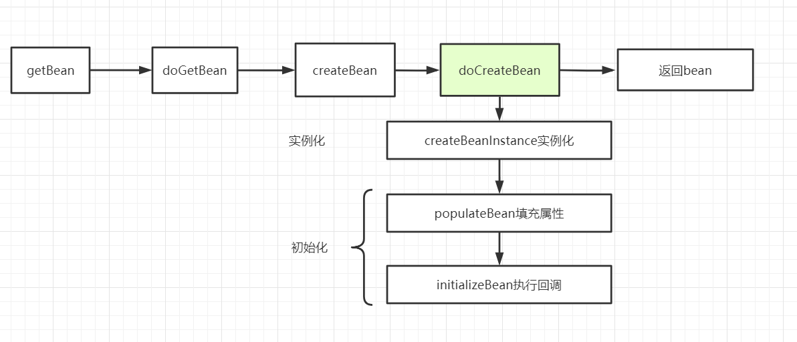

[toc]

# 啥是循环依赖？

下面这种情况比较常见，A中注入了属性B，B中注入了A属性。

```java
@Component
public class A {
    @Autowired
    private B b; //在A中注入B
}
@Component
public class B {
    @Autowired
    private A a; //在B中注入A
}
```

还有一种极限情况，A中注入属性A。

```java
@Component
public class A {
    @Autowired
    private A a;
}
```

# Spring可以解决循环依赖的条件

一、出现循环依赖的Bean**必须是**单例，原型不行。

第一点很好理解，也很好验证，因为原型的Bean，每次获取的时候都会创建一个新的，那么问题来了，假设在初始化A的时候，需要注入原型的B，接着新建一个A，又新建B……无穷尽。如果真是这样，那还得了。因此，原型情况下Spring无法解决循环依赖，会报错：

`aused by: org.springframework.beans.factory.BeanCurrentlyInCreationException: Error creating bean with name 'a': Requested bean is currently in creation: Is there an unresolvable circular reference?`

二、**不全是**构造器注入的方式。

- 均采用setter方法注入，可以被解决。
- 全是构造器注入，无法被解决。
- setter和构造器都存在，具体情况具体分析，Spring会按照AB的顺序选择新创建哪个。为什么先构造器不行，其实和Spring解决循环依赖的策略相关，后面会谈到。

| 依赖情况               | 依赖注入方式                                       | 循环依赖是否被解决 |
| :--------------------- | :------------------------------------------------- | :----------------- |
| AB相互依赖（循环依赖） | 均采用setter方法注入                               | 是                 |
| AB相互依赖（循环依赖） | 均采用构造器注入                                   | 否                 |
| AB相互依赖（循环依赖） | A中注入B的方式为setter方法，B中注入A的方式为构造器 | 是                 |
| AB相互依赖（循环依赖） | B中注入A的方式为setter方法，A中注入B的方式为构造器 | 否                 |

# Spring如何去解决循环依赖

## SpringBean的创建流程

在讨论Spring如何解决循环依赖之前，我们需要清除SpringBean的创建流程，之前的那篇文章讨论了容器的启动销毁与对象完整的生命周期，这里将其中涉及循环依赖的主要部分再做一个说明：



- `createBeanInstance`：实例化，其实也就是调用对象的**构造方法**或者工厂方法实例化对象
- `populateBean`：填充属性，这一步主要是对bean的依赖属性进行注入(`@Autowired`)
- `initializeBean`：回调执行`initMethod`、`InitializingBean`等方法

可以想到，对于单例的bean，在createBeanInstance的时候，应该没啥问题，循环依赖的问题应该发生在第二步属性注入的时候，而这时后这个实例的状态，正好处于：**已经实例化，还未初始化**的中间状态。这一点非常关键！！！！

## Spring维护的三级缓存

在`DefaultSingletonBeanRegistry`类中，维护了三个注释以`Cache of`开头的Map，通过反省可以注意到，三级缓存与前两级缓存不太一样，Map中维护的值是ObjectFactory类型。

```java
//单例缓存池 beanName - instance 一级缓存
private final Map<String, Object> singletonObjects = new ConcurrentHashMap<>(256);

//bean的早期引用, bean name to bean instance 二级缓存
private final Map<String, Object> earlySingletonObjects = new HashMap<>(16);

//单例工厂 beanName - ObjectFactory  三级缓存
private final Map<String, ObjectFactory<?>> singletonFactories = new HashMap<>(16);
```

- `singletonObjects`：一级缓存，一个单例bean【实例化+初始化】都完成之后，将会加入一级缓存，也就是我们俗称的单例池。
- `earlySingletonObjects`：二级缓存，用于存放【实例化完成，还没初始化】的实例，提前暴露，用于解决循环依赖问题。
- `singletonFactories`：三级缓存，存放单例对象工厂ObjectFactory，与二级缓存不同的是，它可以应对产生代理对象。

```java
@FunctionalInterface //函数式接口
public interface ObjectFactory<T> {
	T getObject() throws BeansException;
}
```

还有几个比较重要的集合：

```java
//bean被创建完成之后,注册
private final Set<String> registeredSingletons = new LinkedHashSet<>(256);

//正在创建过程中的bean待的地儿,bean在开始创建的时候放入,知道创建完成将其移除
private final Set<String> singletonsCurrentlyInCreation =
    Collections.newSetFromMap(new ConcurrentHashMap<>(16)); 
```

## getSingleton

AbstractBeanFactory.doGetBean中将会出现两个重载的getSingleton方法：

```java
protected <T> T doGetBean(...){

    Object sharedInstance = getSingleton(beanName);//
	// // typeCheckOnly 为 false，将当前 beanName 放入一个 alreadyCreated 的 Set 集合中。表示已经创建过一次
	if (!typeCheckOnly) {
		markBeanAsCreated(beanName);
	}
	// 这个getSingleton方法非常关键。
	//1、标注a正在创建中~
	//2、调用singletonObject = singletonFactory.getObject();（实际上调用的是createBean()方法）  因此这一步最为关键
	//3、标注此时实例已经创建完成
	//4、执行addSingleton()添加进一级缓存，
    //同时移除二级和三级缓存，还有注册
	sharedInstance = getSingleton(beanName, () -> { ... return createBean(beanName, mbd, args); });
}

```

### getSingleton重载一号

> `protected Object getSingleton(String beanName, boolean allowEarlyReference)`

我们的流程进行到AbstractBeanFactory#doGetBean的时候，会执行`Object sharedInstance = getSingleton(beanName);`，接着会执行`getSingleton(beanName,true)`，一路跟进去，最终会进到DefaultSingletonBeanRegistry 的getSingleton方法，这个方法十分重要，我们具体看一看：

```java

@Nullable
protected Object getSingleton(String beanName, boolean allowEarlyReference) {
    //先从一级缓存中获取,获取到,就直接返回
    Object singletonObject = this.singletonObjects.get(beanName
    //如果一级缓存获取不到,且这个获取的这个bean正在创建中,就从二级缓存中获取
    if (singletonObject == null && isSingletonCurrentlyInCreation(beanName)) { 
        synchronized (this.singletonObjects) {
            //从二级缓存中获取
            singletonObject = this.earlySingletonObjects.get(beanName);
            //还是获取不到,并且allowEarlyReference为true
            if (singletonObject == null && allowEarlyReference) {  
                //从三级缓存中获取
                ObjectFactory<?> singletonFactory = this.singletonFactories.get(beanName); 
                if (singletonFactory != null) {
                    //循环依赖第二次进入的时候，发现A 的三级缓存，于是可以获取到A 的实例，
                    singletonObject = singletonFactory.getObject();
                    //获取到之后将其置入二级缓存
                    this.earlySingletonObjects.put(beanName, singletonObject); 
                    //原先的那个就从三级缓存中移除
                    this.singletonFactories.remove(beanName); 
                }
            }
        }
    }
    return singletonObject;
}
```

1. 先尝试从**一级缓存**中获取，如果获取到，表示这个对象已经【初始化+实例化】全部完成，当然，对于循环依赖的案例来说，这一步都是获取不到的。
2. 如果一级缓存中获取不到，没关系，看看这个bean是不是正在创建中【已经开始实例化，但还没有初始化完全】，如果是这个情况，就尝试从二级缓存中获取。
3. 如果都获取不到，且allowEarlyReference为true的时候，从三级缓存中取，三级缓存中存放的是ObjectFactory。

### getSingleton重载二号

> 另外一个Singleton重载的方法：`public Object getSingleton(String beanName, ObjectFactory<?> singletonFactory)`

```java
public Object getSingleton(String beanName, ObjectFactory<?> singletonFactory) {
    synchronized (this.singletonObjects) {
        Object singletonObject = this.singletonObjects.get(beanName);
            if (singletonObject == null) {
				//将beanName放入到singletonsCurrentlyInCreation这个集合中，标志着这个单例Bean正在创建
                beforeSingletonCreation(beanName);
                boolean newSingleton = false;
                // 传入的lambda在这里会被执行，调用createBean方法创建一个Bean后返回
                singletonObject = singletonFactory.getObject(); 
                newSingleton = true;
                singletonObject = this.singletonObjects.get(beanName);

            }
            // 创建完成后将对应的beanName从singletonsCurrentlyInCreation移除
            afterSingletonCreation(beanName);
    	}
    	if (newSingleton) {
            //加入一级缓存
        	addSingleton(beanName, singletonObject); 
    	}
	}
	return singletonObject;
}
```

## addSingleton

```java
	protected void addSingleton(String beanName, Object singletonObject) {
		synchronized (this.singletonObjects) {
            //加入一级缓存
			this.singletonObjects.put(beanName, singletonObject);
            //三级缓存移除
			this.singletonFactories.remove(beanName);
            //二级缓存移除
			this.earlySingletonObjects.remove(beanName);
            //注册一下
			this.registeredSingletons.add(beanName);
		}
	}

```

## addSingletonFactory

>AbstractAutowireCapableBeanFactory#doCreateBean

在对象实例化完成，初始化之前进行：

```java
protected Object doCreateBean(String beanName, RootBeanDefinition mbd, @Nullable Object[] args)
    throws BeanCreationException {

    // Instantiate the bean. 实例化
    BeanWrapper instanceWrapper = null;
    // 调用构造器或工厂方法 实例化
    instanceWrapper = createBeanInstance(beanName, mbd, args);
    ////我们通常说的bean实例,bean的原始对象,并没有进行初始化的对象 A{ b:null}
    Object bean = instanceWrapper.getWrappedInstance();
    
    //表示是否提前暴露原始对象的引用,对于单例的bean,一般来说为true, 可以通过allowCircularReferences关闭循环引用解决循环依赖问题
    boolean earlySingletonExposure = (mbd.isSingleton() && this.allowCircularReferences &&isSingletonCurrentlyInCreation(beanName)); 
    //是否允许单例提前暴露
    if (earlySingletonExposure) {
        //调用这个方法,将一个ObjectFactory放进三级缓存,二级缓存会对应删除
        //getEarlyBeanReference方法:  1、如果有SmartInstantiationAwareBeanPostProcessor,调用他的getEarlyBeanReference方法,2、如果没有,则不变还是,exposedObject
        //这里也是AOP的实现之处,AbstractAutoProxyCreator implements SmartInstantiationAwareBeanPostProcessor

        addSingletonFactory(beanName, () -> getEarlyBeanReference(beanName, mbd, bean));//在bean实例化后,属性注入之前,Spring将bean包装成一个工厂添加进三级缓存中
    }
	//此时bean已经实例化完成， 开始准备初始化
    // bean为原始对象
    Object exposedObject = bean;
    try {
        //负责属性的装配(如依赖注入)，遇到循环依赖的情况，会在内部getBean("b")->getSingleton(b)
        populateBean(beanName, mbd, instanceWrapper);
        //处理bean初始化完成后的各种回调这里有可能返回一个代理对象
        exposedObject = initializeBean(beanName, exposedObject, mbd);
    }
	//如果bean允许被早期暴露,进入代码
    if (earlySingletonExposure) { 
        //第二参数为false表示不会从三级缓存中在检查，最多从二级缓存中找，其实二级缓存就够了，其实之前getSingleton的时候，已经触发了A 的ObjectFactory.getObject()，A实例已经放入二级缓存中
        Object earlySingletonReference = getSingleton(beanName, false);
        if (earlySingletonReference != null) {
            //如果没有代理，进入这个分支
            if (exposedObject == bean) {
                exposedObject = earlySingletonReference; /
            }
            
}

```


```java
protected void addSingletonFactory(String beanName, ObjectFactory<?> singletonFactory) {
    synchronized (this.singletonObjects) {
        //如果一级缓存中尚未存在
        if (!this.singletonObjects.containsKey(beanName)) { 
            //添加到三级缓存中
            this.singletonFactories.put(beanName, singletonFactory);
            //从二级缓存中移除
            this.earlySingletonObjects.remove(beanName);
            //注册一下
            this.registeredSingletons.add(beanName); 
        }
    }
}
```

## getEarlyBeanReference

前面谈到了这个方法，还没有细说：

```java
    //是否允许单例提前暴露
    if (earlySingletonExposure) {
        addSingletonFactory(beanName, () -> getEarlyBeanReference(beanName, mbd, bean));
    }
```

它实际上就是调用了后置处理器的`getEarlyBeanReference`，而真正实现了这个方法的后置处理器只有`AbstractAutoProxyCreator`，与Aop相关，也就是说，在不考虑Aop的情况下，这个方法压根就和没调用似的。这里我们也能更加明确，三级缓存出现很大程度上也是为了更好处理代理对象。

```java
protected Object getEarlyBeanReference(String beanName, RootBeanDefinition mbd, Object bean) {
    Object exposedObject = bean;
    if (!mbd.isSynthetic() && hasInstantiationAwareBeanPostProcessors()) {
        for (SmartInstantiationAwareBeanPostProcessor bp : getBeanPostProcessorCache().smartInstantiationAware) {
            //调用后值处理器的getEarlyBeanReference  
            exposedObject = bp.getEarlyBeanReference(exposedObject, beanName);
        }
    }
    return exposedObject;
}
```

我们可以跟进去看一看：

```java
	//AbstractAutoProxyCreator
	@Override
	public Object getEarlyBeanReference(Object bean, String beanName) {
		Object cacheKey = getCacheKey(bean.getClass(), beanName);
		this.earlyProxyReferences.put(cacheKey, bean);
        //如果需要的话，返回一个代理对象
		return wrapIfNecessary(bean, beanName, cacheKey);
	}
```

**那么如果考虑可能会存在代理对象出现，这时三级缓存中存在的就是这个代理对象**，并且之后通过getSingleton从三级缓存中取出，放入二级缓存中的也是这个对象。

# 解决循环依赖的流程

> 本质其实就是 让A注入B，B注入A ，B先注入的是一个还没初始化就提前用的A 的引用。【这里不考虑AOP】

以开头的A，B为例，假设他们都使用属性字段注入：

1. A首先getBean，试图获取容器中单例A，第一次容器中还不存在，于是就需要开始创建A。
2. 一顿操作，落点：**A此时已经被实例化完成，但是还没有初始化**，紧接着将A与一个ObjectFactory存入三级缓存 。**如果A被AOP代理，通过这个工厂获取到的就是A代理后的对象，如果没有代理，工厂最后获取到的就是A 的实例化对象。**
3. 初始化A，意为A的属性赋值，这时发现B需要注入，于是getBean，来一遍相同的步骤。
4. 一顿操作，落点：B此时已经被实例化完成，但是还没有初始化，紧接着将B与一个ObjectFactory存入三级缓存 。
5. 初始化B，发现需要注入A，于是getBean("a")，此时它在三级缓存中找到了A与`ObjectFactory<?> singletonFactory`，通过`singletonFactory.getObject();`得到A的引用。并将其存入二级缓存，且从三级缓存移除 。
6. B注入从对象工厂获得的A的引用，此时B已经初始化完成【代表已经注入A成功，其实是拥有了A的引用】，**将B加入到一级缓存，并将B在二级缓存、三级缓存中的玩意清除**，返回。
7. 刚刚是A初始化到一半切出来开始实例化B的，那么接下来也应该返回到A的初始化流程中去。
8. 显然B都已经初始化完毕了，A当然也顺利地初始化成功了，同样，也将A加入一级缓存中，并将A在二级缓存、三级缓存中清除。

9. 至此，Spring解决循环依赖结束，A与B都已实例化+初始化完成，并存入一级缓存，且二级缓存、三级缓存中已经没有了A和B。

> 当然了，这个过程其实是在实例化A的时候，把B一并实例化了，于是在遍历BeanNames实例化B的时候，就不需要进行这么复杂的操作了，因为一级缓存中已经存在B了。

# 为什么先用构造器注入不能解决循环依赖？

原因在于，Spring解决循环依赖其实是在**Bean已经实例化但未初始化**这个中间状态的时候进行处理的，因此bean的实例化与初始化两个操作必须分开，才有机会存入三级缓存，提前暴露原始对象。

但是如果使用如果A先使用构造器，在注入的时候，他会去找B，B再注入A，可此时A并没有暴露，也就失败了。

但如果A先用setter注入，A会先暴露，再注入B，B再注入A的时候，就可以通过三级缓存拿到A了。

# 仅用一级缓存可以解决循环依赖么？

显然不能，Spring通过多个缓存达到存储不同状态的对象：

- 实例化和初始化都已经完成。
- 已经实例化，但还没初始化。

如果只有一级缓存，并发情况下，可能取到实例化但未初始化的对象。

# 为什么需要三级缓存，直接二级暴露引用不行么？

三级缓存使用的是工厂，而不是引用，原因在于：[https://mp.weixin.qq.com/s/kS0K5P4FdF3v-fiIjGIvvQ](https://mp.weixin.qq.com/s/kS0K5P4FdF3v-fiIjGIvvQ)

>  延迟队实例化阶段生成的对象的代理，只有真正发生循环依赖的时候，才去提前生成代理对象，否则只会创建一个工厂并将其放入到三级缓存中，但是不会去通过这个工厂真正创建对象。
>
> 答：**这个工厂的目的在于延迟对实例化阶段生成的对象的代理，只有真正发生循环依赖的时候，才去提前生成代理对象，否则只会创建一个工厂并将其放入到三级缓存中，但是不会去通过这个工厂去真正创建对象**
>
> 我们思考一种简单的情况，就以单独创建A为例，假设AB之间现在没有依赖关系，但是A被代理了，这个时候当A完成实例化后还是会进入下面这段代码：
>
> ```java
> // A是单例的，mbd.isSingleton()条件满足
> // allowCircularReferences：这个变量代表是否允许循环依赖，默认是开启的，条件也满足
> // isSingletonCurrentlyInCreation：正在在创建A，也满足
> // 所以earlySingletonExposure=true
> boolean earlySingletonExposure = (mbd.isSingleton() && this.allowCircularReferences &&
>                                   isSingletonCurrentlyInCreation(beanName));
> // 还是会进入到这段代码中
> if (earlySingletonExposure) {
>  // 还是会通过三级缓存提前暴露一个工厂对象
>     addSingletonFactory(beanName, () -> getEarlyBeanReference(beanName, mbd, bean));
> }
> ```
>
> 看到了吧，即使没有循环依赖，也会将其添加到三级缓存中，而且是不得不添加到三级缓存中，因为到目前为止Spring也不能确定这个Bean有没有跟别的Bean出现循环依赖。
>
> 假设我们在这里直接使用二级缓存的话，那么意味着所有的Bean在这一步都要完成`AOP`代理。这样做有必要吗？
>
> 不仅没有必要，而且违背了Spring在结合`AOP`跟Bean的生命周期的设计！Spring结合`AOP`跟Bean的生命周期本身就是通过`AnnotationAwareAspectJAutoProxyCreator`这个后置处理器来完成的，在这个后置处理的`postProcessAfterInitialization`方法中对初始化后的Bean完成`AOP`代理。如果出现了循环依赖，那没有办法，只有给Bean先创建代理，但是没有出现循环依赖的情况下，设计之初就是让Bean在生命周期的最后一步完成代理而不是在实例化后就立马完成代理。

# 总结

Spring通过三级缓存解决了循环依赖：

- `singletonObjects`：一级缓存，一个单例bean【实例化+初始化】都完成之后，将会加入一级缓存，也就是我们俗称的单例池。
- `earlySingletonObjects`：二级缓存，用于存放【实例化完成，还没初始化】的实例，提前暴露，用于解决循环依赖问题。
- `singletonFactories`：三级缓存，存放单例对象工厂ObjectFactory，与二级缓存不同的是，它可以应对产生代理对象。

Spring不能够解决先用构造器注入情况的循环依赖，原因在于Spring解决循环依赖的关键在于bean实例实例化完成，初始化之前的状态，将其加入三级缓存，提前暴露bean。

> 有点晕了，本来想简单地学习一下，没想到一套接着一套，头晕眼花，还是代码看的太少了，继续努力。感觉有点乱，如果有说的不对的地方，还望评论区指点一二！！抱拳！！！

参考资料：

- [https://blog.csdn.net/f641385712/article/details/92801300](https://blog.csdn.net/f641385712/article/details/92801300)

- [https://mp.weixin.qq.com/s/kS0K5P4FdF3v-fiIjGIvvQ](https://mp.weixin.qq.com/s/kS0K5P4FdF3v-fiIjGIvvQ)

- [https://blog.csdn.net/cszhang570221322/article/details/84656329](https://blog.csdn.net/cszhang570221322/article/details/84656329)