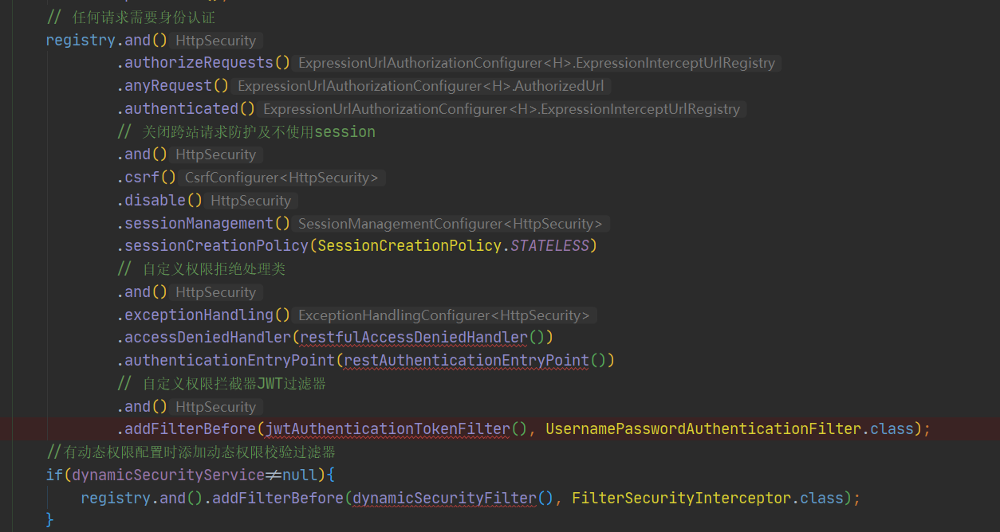
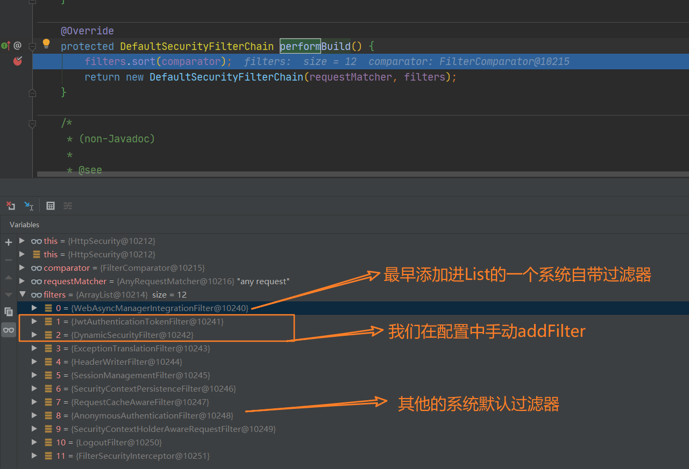
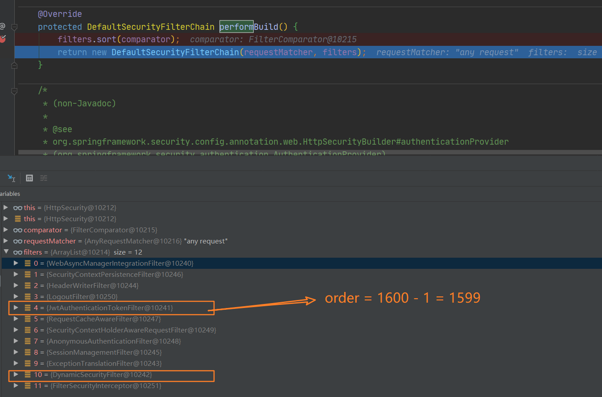

# SpringSecurity中对过滤器的配置：addFilterBefore

SpringSecurity基于Filter技术，通过一系列内置的或自定义的安全Filter，实现接口的认证与授权。我们一定在使用的过程中，定义过WebSecurityConfigurerAdapter的扩展，为程序自定义配置逻辑。

比如，我们想要自定义基于JWT拦截的过滤器，我们可以通过`addFilterBefore(jwtAuthenticationTokenFilter(), UsernamePasswordAuthenticationFilter.class);`的方式，将过滤器按照一定顺序加入过滤器链。



addFilterBefore在HttpSecurity类中：

```java
public HttpSecurity addFilterBefore(Filter filter,
                                    Class<? extends Filter> beforeFilter) {
    comparator.registerBefore(filter.getClass(), beforeFilter);
    return addFilter(filter);
}
```

见名知义，意思是**在指定的beforeFilter之前加入filter**。这里的comparator是内置的一个用于比较注册顺序的一个类，可以大致看一看：可以看到构造器初始化了map，key为过滤器的类对象，value为order。

order的顺序也是确定的，举个例子，ChannelProcessingFilter的order值为100，后面每多一个，就加上100。

```java
final class FilterComparator implements Comparator<Filter>, Serializable {
    private static final int INITIAL_ORDER = 100;
    private static final int ORDER_STEP = 100;
    private final Map<String, Integer> filterToOrder = new HashMap<>();

    FilterComparator() { //初始化了一些默认的Filter并规定的order
        Step order = new Step(INITIAL_ORDER, ORDER_STEP);//越往下order越大
        put(ChannelProcessingFilter.class, order.next()); //100
        put(ConcurrentSessionFilter.class, order.next()); //200
        put(WebAsyncManagerIntegrationFilter.class, order.next());
        put(SecurityContextPersistenceFilter.class, order.next());
        put(HeaderWriterFilter.class, order.next());
        put(CorsFilter.class, order.next());
        put(CsrfFilter.class, order.next());
        put(LogoutFilter.class, order.next());
        //...省略
    }
```

compare方法定义了比较的规则：**依照order排序，小的在前，大的在后**。

```java
public int compare(Filter lhs, Filter rhs) {
    Integer left = getOrder(lhs.getClass());
    Integer right = getOrder(rhs.getClass());
    return left - right;
}
```

## registerBefore

以`registerBefore`为例，其他类似的还有`registerAt,registerAfter`。

```java
public void registerBefore(Class<? extends Filter> filter,
                           Class<? extends Filter> beforeFilter) {
    Integer position = getOrder(beforeFilter);//得到要加入的filter的位置
    if (position == null) {}
    put(filter, position - 1);//将当的filter存入map
}
```

## addFilter

向`List<Filter> `中加入filter。

```java
public HttpSecurity addFilter(Filter filter) {
    Class<? extends Filter> filterClass = filter.getClass();
    if (!comparator.isRegistered(filterClass)) {}
    this.filters.add(filter);//向List<Filter> 中加入filter
    return this;
}
```

在所有的Filter添加完成之后，Filter其实并没有按照order进行排序，因为暂时还是按照读取的顺序进行加入的List，只有当执行了`HttpSecurity.performBuild`之后，才形成按照order排序的Filter数组。



在进行sort之后，根据order进行排序，生成的列表List就是最终的Filter列表。

