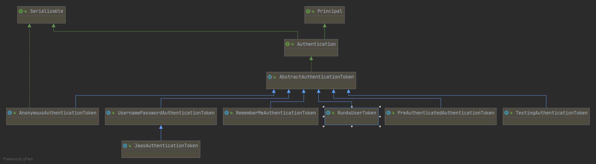

[toc]

本篇文章参考于【江南一点雨】的公众号。

# Authentication



使用SpringSecurity可以在任何地方注入Authentication进而获取到当前登录的用户信息，可谓十分强大。

在Authenticaiton的继承体系中，实现类UsernamePasswordAuthenticationToken 算是比较常见的一个了，在这个类中存在两个属性：principal和credentials，其实分别代表着用户和密码。【当然其他的属性存在于其父类中，如`authorities`和`details`。】

我们需要对这个对象有一个基本地认识，它保存了用户的基本信息。用户在登录的时候，进行了一系列的操作，将信息存与这个对象中，后续我们使用的时候，就可以轻松地获取这些信息了。

那么，用户信息如何存，又是如何取的呢？继续往下看吧。

# 登录流程

## 一、与认证相关的UsernamePasswordAuthenticationFilter

通过Servlet中的Filter技术进行实现，通过一系列内置的或自定义的安全Filter，实现接口的认证与授权。

比如：`UsernamePasswordAuthenticationFilter`


```java
public Authentication attemptAuthentication(HttpServletRequest request,
                                            HttpServletResponse response) throws AuthenticationException {
    if (postOnly && !request.getMethod().equals("POST")) {
        throw new AuthenticationServiceException(
            "Authentication method not supported: " + request.getMethod());
    }
    //获取用户名和密码
    String username = obtainUsername(request);
    String password = obtainPassword(request);

    if (username == null) {
        username = "";
    }

    if (password == null) {
        password = "";
    }
    username = username.trim();
    //构造UsernamePasswordAuthenticationToken对象
    UsernamePasswordAuthenticationToken authRequest = new UsernamePasswordAuthenticationToken(
        username, password);

    // 为details属性赋值
    setDetails(request, authRequest);
    // 调用authenticate方法进行校验
    return this.getAuthenticationManager().authenticate(authRequest);
}
```

### 获取用户名和密码

从request中提取参数，这也是SpringSecurity默认的表单登录需要通过key/value形式传递参数的原因。

```java
@Nullable
protected String obtainPassword(HttpServletRequest request) {
    return request.getParameter(passwordParameter);
}
@Nullable
protected String obtainUsername(HttpServletRequest request) {
    return request.getParameter(usernameParameter);
}
```

### 构造UsernamePasswordAuthenticationToken对象

传入获取到的用户名和密码，而用户名对应UPAT对象中的principal属性，而密码对应credentials属性。

```java
UsernamePasswordAuthenticationToken authRequest = new UsernamePasswordAuthenticationToken(
    username, password);

//UsernamePasswordAuthenticationToken 的构造器
public UsernamePasswordAuthenticationToken(Object principal, Object credentials) {
    super(null);
    this.principal = principal;
    this.credentials = credentials;
    setAuthenticated(false);
}
```

### 为details属性赋值

```java
// Allow subclasses to set the "details" property 允许子类去设置这个属性
setDetails(request, authRequest);

protected void setDetails(HttpServletRequest request,
                          UsernamePasswordAuthenticationToken authRequest) {
    authRequest.setDetails(authenticationDetailsSource.buildDetails(request));
}

//AbstractAuthenticationToken 是UsernamePasswordAuthenticationToken的父类
public void setDetails(Object details) {
    this.details = details;
}
```

details属性存在于父类之中，主要描述两个信息，一个是remoteAddress 和sessionId。

```java
public WebAuthenticationDetails(HttpServletRequest request) {
    this.remoteAddress = request.getRemoteAddr();

    HttpSession session = request.getSession(false);
    this.sessionId = (session != null) ? session.getId() : null;
}
```

### 调用authenticate方法进行校验

```java
this.getAuthenticationManager().authenticate(authRequest)
```

## 二、ProviderManager的校验逻辑

```java
public Authentication authenticate(Authentication authentication)
    throws AuthenticationException {
    Class<? extends Authentication> toTest = authentication.getClass();
    AuthenticationException lastException = null;
    AuthenticationException parentException = null;
    Authentication result = null;
    Authentication parentResult = null;
    boolean debug = logger.isDebugEnabled();

    for (AuthenticationProvider provider : getProviders()) {
        //获取Class，判断当前provider是否支持该authentication
        if (!provider.supports(toTest)) {
            continue;
        }
        //如果支持，则调用provider的authenticate方法开始校验
        result = provider.authenticate(authentication);
        
		//将旧的token的details属性拷贝到新的token中。
        if (result != null) {
            copyDetails(authentication, result);
            break;
        }
    }
    //如果上一步的结果为null，调用provider的parent的authenticate方法继续校验。
    if (result == null && parent != null) {
        result = parentResult = parent.authenticate(authentication);
    }

    if (result != null) {
        if (eraseCredentialsAfterAuthentication
            && (result instanceof CredentialsContainer)) {
            //调用eraseCredentials方法擦除凭证信息
            ((CredentialsContainer) result).eraseCredentials();
        }
        if (parentResult == null) {
            //publishAuthenticationSuccess将登录成功的事件进行广播。
            eventPublisher.publishAuthenticationSuccess(result);
        }
        return result;
    }
}
```

1. 获取Class，判断当前provider是否支持该authentication。

2. 如果支持，则调用provider的authenticate方法开始校验，校验完成之后，返回一个新的Authentication。

3. 将旧的token的details属性拷贝到新的token中。

4. 如果上一步的结果为null，调用provider的parent的authenticate方法继续校验。

5. 调用eraseCredentials方法擦除凭证信息，也就是密码，具体来说就是让credentials为空。

6. publishAuthenticationSuccess将登录成功的事件进行广播。

   

## 三、AuthenticationProvider的authenticate

```java
public Authentication authenticate(Authentication authentication)
		throws AuthenticationException {
    //从Authenticaiton中提取登录的用户名。
	String username = (authentication.getPrincipal() == null) ? "NONE_PROVIDED"
			: authentication.getName();
    //返回登录对象
	user = retrieveUser(username,(UsernamePasswordAuthenticationToken) authentication);
    //校验user中的各个账户状态属性是否正常
	preAuthenticationChecks.check(user);
    //密码比对
	additionalAuthenticationChecks(user,(UsernamePasswordAuthenticationToken) authentication);
    //密码比对
	postAuthenticationChecks.check(user);
	Object principalToReturn = user;
    //表示是否强制将Authentication中的principal属性设置为字符串
	if (forcePrincipalAsString) {
		principalToReturn = user.getUsername();
	}
    //构建新的UsernamePasswordAuthenticationToken
	return createSuccessAuthentication(principalToReturn, authentication, user);
}
```

1. 从Authenticaiton中提取登录的用户名。
2. `retrieveUser`方法将会调用`loadUserByUsername`方法，这里将会返回登录对象。
3. `preAuthenticationChecks.check(user);`校验user中的各个账户状态属性是否正常，如账号是否被禁用，账户是否被锁定，账户是否过期等。
4. `additionalAuthenticationChecks`用于做密码比对，密码加密解密校验就在这里进行。
5. `postAuthenticationChecks.check(user);`用于密码比对。
6. `forcePrincipalAsString`表示是否强制将Authentication中的principal属性设置为字符串，默认为false，也就是说默认登录之后获取的用户是对象，而不是username。
7. 构建新的`UsernamePasswordAuthenticationToken`。

# 用户信息保存

我们来到UsernamePasswordAuthenticationFilter 的父类AbstractAuthenticationProcessingFilter 中，

```java
public void doFilter(ServletRequest req, ServletResponse res, FilterChain chain)
		throws IOException, ServletException {
	HttpServletRequest request = (HttpServletRequest) req;
	HttpServletResponse response = (HttpServletResponse) res;
	Authentication authResult;
	try {
        //实际触发了上面提到的attemptAuthentication方法
		authResult = attemptAuthentication(request, response);
		if (authResult == null) {
			return;
		}
		sessionStrategy.onAuthentication(authResult, request, response);
	}
    //登录失败
	catch (InternalAuthenticationServiceException failed) {
		unsuccessfulAuthentication(request, response, failed);
		return;
	}
	catch (AuthenticationException failed) {
		unsuccessfulAuthentication(request, response, failed);
		return;
	}
	if (continueChainBeforeSuccessfulAuthentication) {
		chain.doFilter(request, response);
	}
    //登录成功
	successfulAuthentication(request, response, chain, authResult);
}
```

关于登录成功调用的方法：

```java
protected void successfulAuthentication(HttpServletRequest request,
		HttpServletResponse response, FilterChain chain, Authentication authResult)
		throws IOException, ServletException {
    //将登陆成功的用户信息存储在SecurityContextHolder.getContext()中
	SecurityContextHolder.getContext().setAuthentication(authResult);
	rememberMeServices.loginSuccess(request, response, authResult);
	// Fire event
	if (this.eventPublisher != null) {
		eventPublisher.publishEvent(new InteractiveAuthenticationSuccessEvent(
				authResult, this.getClass()));
	}
    //登录成功的回调方法
	successHandler.onAuthenticationSuccess(request, response, authResult);
}
```

我们可以通过`SecurityContextHolder.getContext().setAuthentication(authResult);`得到两点结论：

- 如果我们想要获取用户信息，我们只需要调用`SecurityContextHolder.getContext().getAuthentication()`即可。
- 如果我们想要更新用户信息，我们只需要调用`SecurityContextHolder.getContext().setAuthentication(authResult);`即可。

# 用户信息的获取

前面说到，我们可以利用Authenticaiton轻松得到用户信息，主要有下面几种方法：

- 通过上下文获取。

```java
SecurityContextHolder.getContext().getAuthentication();
```

- 直接在Controller注入Authentication。

```java
@GetMapping("/hr/info")
public Hr getCurrentHr(Authentication authentication) {
    return ((Hr) authentication.getPrincipal());
}
```

## 为什么多次请求可以获取同样的信息

前面已经谈到，SpringSecurity将登录用户信息存入SecurityContextHolder 中，本质上，其实是存在ThreadLocal中，为什么这么说呢？

原因在于，SpringSecurity采用了策略模式，在SecurityContextHolder 中定义了三种不同的策略，而如果我们不配置，默认就是`MODE_THREADLOCAL`模式。

```java
	
public static final String MODE_THREADLOCAL = "MODE_THREADLOCAL";
public static final String MODE_INHERITABLETHREADLOCAL = "MODE_INHERITABLETHREADLOCAL";
public static final String MODE_GLOBAL = "MODE_GLOBAL";
public static final String SYSTEM_PROPERTY = "spring.security.strategy";
private static String strategyName = System.getProperty(SYSTEM_PROPERTY);

private static void initialize() {
    if (!StringUtils.hasText(strategyName)) {
        // Set default
        strategyName = MODE_THREADLOCAL;
    }
    if (strategyName.equals(MODE_THREADLOCAL)) {
        strategy = new ThreadLocalSecurityContextHolderStrategy();
    }   
}

private static final ThreadLocal<SecurityContext> contextHolder = new ThreadLocal<>();
```

了解这个之后，又有一个问题抛出：ThreadLocal能够保证同一线程的数据是一份，那进进出出之后，线程更改，又如何保证登录的信息是正确的呢。

这里就要说到一个比较重要的过滤器：`SecurityContextPersistenceFilter`，它的优先级很高，仅次于`WebAsyncManagerIntegrationFilter`。也就是说，在进入后面的过滤器之前，将会先来到这个类的doFilter方法。

```java
public class SecurityContextPersistenceFilter extends GenericFilterBean {
	public void doFilter(ServletRequest req, ServletResponse res, FilterChain chain)
			throws IOException, ServletException {
		HttpServletRequest request = (HttpServletRequest) req;
		HttpServletResponse response = (HttpServletResponse) res;
        if (request.getAttribute(FILTER_APPLIED) != null) {
			// 确保这个过滤器只应对一个请求
			chain.doFilter(request, response);
			return;
		}
        //分岔路口之后，表示应对多个请求
		HttpRequestResponseHolder holder = new HttpRequestResponseHolder(request,
				response);
        //用户信息在 session 中保存的 value。
		SecurityContext contextBeforeChainExecution = repo.loadContext(holder);
		try {
            //将当前用户信息存入上下文
			SecurityContextHolder.setContext(contextBeforeChainExecution);
			chain.doFilter(holder.getRequest(), holder.getResponse());
		}
		finally {
            //收尾工作，获取SecurityContext
			SecurityContext contextAfterChainExecution = SecurityContextHolder
					.getContext();
            //清空SecurityContext
			SecurityContextHolder.clearContext();
            //重新存进session中
			repo.saveContext(contextAfterChainExecution, holder.getRequest(),
					holder.getResponse());
		}
	}
}
```

1. `SecurityContextPersistenceFilter` 继承自 `GenericFilterBean`，而 `GenericFilterBean `则是 Filter 的实现，所以 `SecurityContextPersistenceFilter `作为一个过滤器，它里边最重要的方法就是 `doFilter `了。
2. 在 `doFilter` 方法中，它首先会从 repo 中读取一个 `SecurityContext` 出来，这里的 repo 实际上就是 `HttpSessionSecurityContextRepository`，读取 `SecurityContext` 的操作会进入到 `readSecurityContextFromSession(httpSession)` 方法中。
3. 在这里我们看到了读取的核心方法 `Object contextFromSession = httpSession.getAttribute(springSecurityContextKey);`，这里的 `springSecurityContextKey` 对象的值就是 `SPRING_SECURITY_CONTEXT`，读取出来的对象最终会被转为一个 `SecurityContext `对象。
4. `SecurityContext` 是一个接口，它有一个唯一的实现类 `SecurityContextImpl`，这个实现类其实就是用户信息在 session 中保存的 value。
5. 在拿到 `SecurityContext` 之后，通过 `SecurityContextHolder.setContext `方法将这个 `SecurityContext` 设置到` ThreadLocal` 中去，这样，在当前请求中，Spring Security 的后续操作，我们都可以直接从` SecurityContextHolder` 中获取到用户信息了。
6. 接下来，通过` chain.doFilter` 让请求继续向下走（这个时候就会进入到 `UsernamePasswordAuthenticationFilter` 过滤器中了）。
7. 在过滤器链走完之后，数据响应给前端之后，**finally 中还有一步收尾操作，这一步很关键**。这里从 `SecurityContextHolder` 中获取到 `SecurityContext`，获取到之后，会把 `SecurityContextHolder `清空，然后调用 `repo.saveContext` 方法将获取到的 `SecurityContext `存入 session 中。

**总结**：

>  每个请求到达服务端的时候，首先从session中找出SecurityContext ，为了本次请求之后都能够使用，设置到SecurityContextHolder 中。
>
>  当请求离开的时候，SecurityContextHolder 会被清空，且SecurityContext 会被放回session中，方便下一个请求来获取。

## 资源放行的两种方式

用户登录的流程只有走过滤器链，才能够将信息存入session中，因此我们配置登录请求的时候需要使用configure(HttpSecurity http)，因为这个配置会走过滤器链。

```java
http.authorizeRequests()
        .antMatchers("/hello").permitAll()
        .anyRequest().authenticated()
```

而 configure(WebSecurity web)不会走过滤器链，适用于静态资源的放行。

```java
@Override
public void configure(WebSecurity web) throws Exception {
 	web.ignoring().antMatchers("/index.html","/img/**","/fonts/**","/favicon.ico");
}
```

