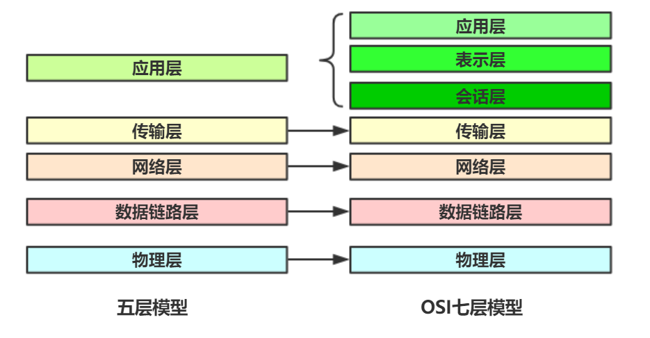
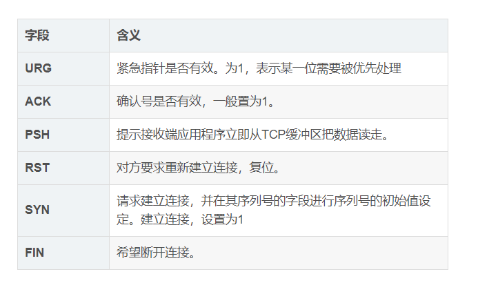
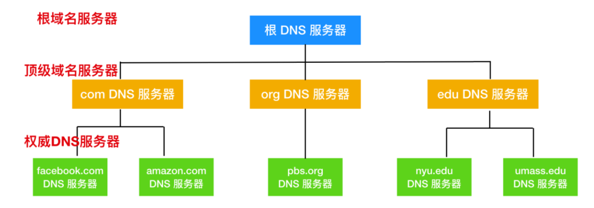

[toc]

# URL和URI的区别

- `URL(Uniform Resource Location) `是统一资源定位符，可以提供该资源的路径。它是一种具体的 URI，即 URL 可以用来标识一个资源，而且还指明了如何 locate 这个资源。
- `URI(Uniform Resource Identifier) `是统一资源标志符，可以唯一标识一个资源。

# HTTP和HTTPS的区别

HTTP的默认端口是80 ，而HTTPS的默认端口为443。

HTTP在地址栏上的协议以http://开头，而HTTPS以https://开头。

HTTP是未经安全加密的协议，传输过程容易被攻击者监听，数据容易被窃取，发送方和接收方容易被伪造。而HTTPS是安全的协议，通过**密钥交换算法 - 签名算法 - 对称加密算法 - 摘要算法**能够解决上面的这些问题。

HTTP是应用层协议，HTTPS是HTTP+TLS/SSL，在HTTP的基础上披了一层SSL，多了secure安全性的概念，并非新的应用层协议。

# HTTP1.0，1.1，2.0的区别

**HTTP 1.0**

- 只提供了最基本的认证，用户名和密码还未经加密，很容易受到窥探。
- **短连接**，每次发送数据都会经过TCP的三次握手和四次挥手，效率低。
- 只使用header中的If-Modified-Since和Expires作为缓存失效的标准。
- 不支持断点续传，每次都会传送全部的页面和数据。
- 认为每台计算机只能绑定一个IP，所以请求消息中的URL并没有传递主机名。

**HTTP 1.1**

- 使用摘要算法进行身份验证。
- **默认使用长连接**，一次建立，中间可以传输多次数据，之后只需断开一次连接即可。长连接的连接时长可以通过请求头中的keep-alive来设置。
- **缓存处理**，新增了E-tag，If-Unmodified-Since，If-Match，If-None-Match等缓存控制标头来控制缓存失效。
- 支持**断点续传**，通过使用请求头中的Range实现。
- 使用虚拟网络，在一台物理服务器上可以存在多个虚拟主机，并且它们共享一个IP地址。

**HTTP 2.0**

- **头部压缩**：由于 HTTP 1.1 经常会出现 **User-Agent、Cookie、Accept、Server、Range** 等字段可能会占用几百甚至几千字节，而 Body 却经常只有几十字节，所以导致头部偏重。HTTP 2.0 使用 `HPACK` 算法进行压缩。
- **二进制格式**：HTTP 2.0 使用了更加靠近 TCP/IP 的二进制格式，而抛弃了 ASCII 码，提升了解析效率。
- **强化安全**：由于安全已经成为重中之重，所以 HTTP2.0 一般都跑在 HTTPS 上。
- **多路复用**：即每一个请求都是是用作连接共享。一个请求对应一个id，这样一个连接上可以有多个请求。

# 常见HTTP状态码

| 状态码 | 含义                                                         |
| ------ | ------------------------------------------------------------ |
| 1xx    | 表示成功接收请求，要求客户端继续提交下一次请求才能完成整个处理流程 |
|  2xx | 表示成功接收请求并已完成整个处理流程，200 OK |
| 3xx | 浏览器需要执行特殊的处理以正确处理请求，302临时性重定向 |
| 4xx | 表示客户端发生了错误， 404 NOT FOUND |
| 5xx | 表示服务器端出现了错误，500 |

# HTTP协议本身是无状态的，如何保存用户的状态

HTTP 是一种不保存状态，即无状态（stateless）协议，不对请求和响应之间的通信状态进行保存。

可以使用session机制，在服务端记录用户的状态。

> 典型的场景是购物车，当你要添加商品到购物车的时候，系统不知道是哪个用户操作的，因为 HTTP 协议是无状态的。服务端给特定的用户创建特定的 Session 之后就可以标识这个用户并且跟踪这个用户了（一般情况下，服务器会在一定时间内保存这个 Session，过了时间限制，就会销毁这个Session）。

# Cookie和Session的区别

Cookie用于在客户端记录用户的状态，用户可以通过浏览器禁用Cookie，而Session通过在服务端记录用户的状态，不依赖于浏览器。

Session较Cookie存储安全性更高，如果要在 Cookie 中存储一些敏感信息，不要直接写入 Cookie 中，最好能将 Cookie 信息加密然后使用到的时候再去服务器端解密。

# TCP/IP模型与OSI模型

TCP/IP模型有时也分为四层：物理层和数据链路层合并表示为网络接口层。

# TCP与UDP的区别

TCP和UDP都是传输层的协议。

**连接方面**

TCP**面向连接**，发送数据前两端必须建立连接【三次握手】。

UCP是无连接的，发送数据之前不需要建立连接。

**安全方面**

TCP提供**可靠**的服务通过TCP连接传送的数据，无差错，不丢失，不重复，且按序到达。

- 支持错误重传机制。
- 支持拥塞控制，能够在网络拥堵的情况下延迟发送。
- 提供错误校验和，甄别有害的数据包， 并进行错误恢复。

UDP尽最大努力交付，即**不保证可靠交付**。

**传输效率**

TCP传输效率相对较低。

UDP传输效率高，适用于对高速传输和实时性有较高的通信或广播通信。

**连接对象数量**

TCP连接**只能是点到点**、一对一的。

UDP支持一对一，一对多，多对一和多对多的交互通信。

**面向的对象**

UDP面向报文，对应用层交下来的报文，既不合并，也不拆分，而是保留这些报文的边界。

TCP面向字节流，在不保留报文边界的情况下以字节流方式进行传输。

**首部开销**

TCP首部开销大，最小20字节，最大60字节。

UDP首部开销小，仅8字节。

**适用场景**

TCP：适用于需要可靠传输的应用，如文件传输。

UDP：适用于实时应用：视频会议，直播等。

# TCP协议是如何保证可靠传输的？

1. 应用数据被分割成TCP认为最合适发送的数据块。
2. TCP给发送的每一个包进行编号，接收方对数据包进行排序，把有序数据传送给应用层。
3. **校验和：** TCP 将保持它首部和数据的检验和。这是一个端到端的检验和，目的是检测数据在传输过程中的任何变化。如果收到段的检验和有差错，TCP 将丢弃这个报文段和不确认收到此报文段。
4. TCP 的接收端会丢弃重复的数据。
5. **流量控制：** TCP 连接的每一方都有固定大小的缓冲空间，TCP的接收端只允许发送端发送接收端缓冲区能接纳的数据。当接收方来不及处理发送方的数据，能提示发送方降低发送的速率，防止包丢失。TCP 使用的流量控制协议是可变大小的滑动窗口协议。 （TCP 利用滑动窗口实现流量控制）
6. **拥塞控制：** 当网络拥塞时，减少数据的发送。
7. **ARQ协议：** 也是为了实现可靠传输的，它的基本原理就是每发完一个分组就停止发送，等待对方确认。在收到确认后再发下一个分组。
8. **超时重传：** 当 TCP 发出一个段后，它启动一个定时器，等待目的端确认收到这个报文段。如果不能及时收到一个确认，将重发这个报文段。

# HTTP请求中GET和POST的方法区别

- GET在浏览器回退是无害的，而POST会再次提交请求
- GET请求会被浏览器主动cache,而POST不会，除非手动设置
- GET请求只能进行URL编码，而POST支持多种编码
- GET请求参数会被完整保留在浏览器历史记录中，而POST中的参数不会被保留
- GET请求在URL中传送参数是有大小限制的，不能大于2KB,而POST可以说没有
- GET只接受ASCII字符，而POST没有限制
- GET参数直接暴露在URL上，而POST将数据放在request body中

# TCP报文结构及含义

**源端口和目的端口**：唯一确定一条TCP连接，TCP在发送数据前必须在彼此间建立连接，意思是：双方需要保存对方的信息。

**序列号seq**：占4个字节，用于标记数据段的顺序，TCP把连接中发送的所有数据字节都编上一个序号，第一个字节的编号由本地随机产生，给字节编上序号后，就给每一个报文段指派一个序号；**序列号seq就是这个报文段中的第一个字节的数据编号**，确保TCP传输有序。

**确认号ack**：占4个字节，**期待收到对方下一个报文段的第一个数据字节的序号**；序列号表示报文段携带数据的第一个字节的编号；而确认号指的是期望接收到下一个字节的编号；因此**当前报文段最后一个字节的编号+1即为确认号**。

**确认ACK**：占1位，**仅当ACK=1时，确认号字段才有效**。ACK=0时，确认号无效。

**同步SYN**：连接建立时用于**同步序号**。当SYN=1，ACK=0时表示：这是一个连接请求报文段。若同意连接，则在响应报文段中使得SYN=1，ACK=1。因此，SYN=1表示这是一个连接请求，或连接接受报文。**SYN这个标志位只有在TCP建产连接时才会被置1，握手完成后SYN标志位被置0**。

**终止FIN**：用来**释放一个连接**。FIN=1表示：此报文段的发送方的数据已经发送完毕，并要求释放运输连接

**其他标志位的含义**：

# 三次握手与四次挥手

## 三次握手

1. 第一次握手：客户端发送初始序号seq = x和SYN=1的请求标志。此时**服务器得知客户端发送正常，自己接收正常**。
2. 第二次握手：服务器发送请求标志SYN=1,确认标志ACK=1，自己的序号seq=y，发送客户端的确认信号x+1。**客户端知道自己发送、接收正常，服务器接收、发送正常**。
3. 第三次握手：客户端发送确认信号ACK=1，发送自己的序号seq=x+1，发送对方的确认号ACK=y+1。**服务器知道客户端发送、接收正常，自己接收、发送也正常**。

## 四次挥手

1. 第一次挥手：客户端发出释放FIN=1，自己序列号seq=u，进入FIN-WAIT-1状态，是客户端的请求断开。

2. 第二次挥手：服务器收到客户端的请求后，发出ACK=1确认标志和客户端的确认号ack=u+1，自己的序列号seq=v，进入CLOSE-WAIT状态，服务器确认客户端的断开请求。

3. 第三次挥手：客户端收到服务器确认结果后，进入FIN-WAIT-2状态。此时服务器发送释放FIN=1信号，确认标志ACK=1，确认序号ack=u+1，自己序号seq=w，服务器进入LAST-ACK（最后确认态），服务器请求断开。

4. 第四次挥手：客户端收到回复后，发送确认ACK=1，ack=w+1，自己的seq=u+1，客户端进入TIME-WAIT（时间等待）。客户端经过2个最长报文段寿命后，客户端CLOSE；服务器收到确认后，立刻进入CLOSE状态，客户端确认服务器断开。

### 为什么连接的时候是三次握手，关闭的时候却是四次挥手？

连接时，当服务端收到客户端的SYN连接请求报文后，**可以直接发送SYN+ACK报文**，对应用于同步+应答。

连接关闭时，当服务端收到FIN报文时，也许还有话要说，**并不会立即关闭SOCKET，所以不会立即返回一个FIN，而是先回复一个ACK报文**，告诉客户端自己已经收到了FIN，而只有等服务端把要说的话说完，才能发送FIN，因此需要四步。

### 为什么TIME_WAIT状态需要经过2MSL才能返回到CLOSE状态？

我们需要假想**网络传输是不可靠的，有可能最后一个ACK将会丢失**，TIME_WAIT状态可以用来重发可能丢失的ACK报文。在客户端发出最后的ACK回复时，如果服务端没有收到ACK，它将不断重复发送FIN片段，所以客户端不能立即关闭，它必须确认服务端收到了该ACK。

客户端会在发出ACK之后进入TIME_WAIT的状态，并等待两倍的MSL的时间，Maximum Segment Lifetime，片段在网络中的最大生存时间，两倍的MSL就是一个发送和一个回复所需要的最大时间，如果超出该时间，客户端还没有再次收到FIN，那么客户端就会推断ACK已经被成功接收，此时TCP连接结束。

### 为什么不能用两次握手进行连接？

三次握手完成了两个重要的功能：

- 双方做好发送数据的**准备**工作。
- 允许双方就**初始序列号**进行协商，这个序列号在握手过程中被发送和确认。

**现在把三次握手改成仅需要两次握手，死锁是可能发生的**。作为例子，考虑计算机S和C之间的通信，假定C给S发送一个连接请求分组，S收到了这个分组，并发 送了确认应答分组。按照两次握手的协定，S认为连接已经成功地建立了，可以开始发送数据分组。可是，C在S的应答分组在传输中被丢失的情况下，将不知道S 是否已准备好，不知道S建立什么样的序列号，C甚至怀疑S是否收到自己的连接请求分组。在这种情况下，C认为连接还未建立成功，将忽略S发来的任何数据分 组，只等待连接确认应答分组。而S在发出的分组超时后，重复发送同样的分组。这样就形成了死锁。

### 如果已经建立了连接，但是客户端突然出现故障了怎么办？

TCP还设有一个保活计时器，显然，客户端如果出现故障，服务器不能一直等下去，白白浪费资源。**服务器每收到一次客户端的请求后都会重新复位这个计时器，时间通常是设置为2小时**，若两小时还没有收到客户端的任何数据，服务器就会发送一个探测报文段，以后每隔75秒钟发送一次。若一连发送10个探测报文仍然没反应，服务器就认为客户端出了故障，接着就关闭连接。

# 从输入网址到获取页面发生了什么？

- 根据输入的URL地址，查询DNS， 获取域名对应的IP地址
  - 浏览器搜索自身的DNS缓存
  - 发起系统调用查询本机hosts文件是否有配置ip地址
  - 发起一个DNS系统调用（宽带运营服务器查看本身缓存，运营服务器发起一个迭代DNS解析请求）
- 浏览器**获得域名对应的IP地址后，需要和目标服务器建立TCP连接，需要经过三次握手的过程**
- TCP/IP建立连接后，浏览器可以向服务器**发送HTTP请求**了
- 服务器接收到请求后，根据路径参数，经过后端处理将页面返回给浏览器
  - 如果是一个简单页面，将会直接返回。
  - 如果是需要重定向，返回的状态码为3开头的重定向码，浏览器在响应的报文中Location中找到重定向地址，继续第一步。
- 浏览器渲染页面，和外部资源，最终将完整的页面呈现给用户

# DNS是啥？

**DNS(Domain Name System) 域名系统**

提供能够将把主机名【如www.balabala.com】转化为IP地址【10.33.21.12】的转换服务。DNS 是一种由分层的 DNS 服务器实现的分布式数据库。DNS 运行在 UDP 上，使用 53 端口。

图片来源：https://mp.weixin.qq.com/s/t7ZYT6wBBbFYVBPOSztpRg

一般域名服务器层次结构主要是上面三种：

- 根域名服务器
- 顶级域名服务器
- 权威DNS服务器

还有一种很重要的DNS服务器：**本地DNS服务器 local DNS server**，

> 严格来说，本地 DNS 服务器并不属于上述层次结构，但是本地 DNS 服务器又是至关重要的。每个 `ISP(Internet Service Provider)` 比如居民区的 ISP 或者一个机构的 ISP 都有一台本地 DNS 服务器。当主机和 ISP 进行连接时，该 ISP 会提供一台主机的 IP 地址，该主机会具有一台或多台其本地 DNS 服务器的 IP地址。通过访问网络连接，用户能够容易的确定 DNS 服务器的 IP地址。当主机发出 DNS 请求后，该请求被发往本地 DNS 服务器，它起着代理的作用，并将该请求转发到 DNS 服务器层次系统中。

查询请求会先找到本地 DNS 服务器来查询是否包含 IP 地址，如果本地 DNS 无法查询到目标 IP 地址，就会向根域名服务器发起一个 DNS 查询。在由【根域名服务器 -> 顶级域名服务器 -> 权威 DNS 服务器】后，由权威服务器告诉本地服务器目标 IP 地址，再有本地 DNS 服务器告诉用户需要访问的 IP 地址。

**DNS涉及两种查询方式**：

1. 递归查询：如果根域名服务器无法告知本地 DNS 服务器下一步需要访问哪个顶级域名服务器，就会使用递归查询。
2. 迭代查询：如果根域名服务器能够告知 DNS 服务器下一步需要访问的顶级域名服务器，就会使用迭代查询。

# 参考

- [https://mp.weixin.qq.com/s/t7ZYT6wBBbFYVBPOSztpRg](https://mp.weixin.qq.com/s/t7ZYT6wBBbFYVBPOSztpRg)
- [JavaGuide 计算机网络部分](https://snailclimb.gitee.io/javaguide/#/docs/network/%E8%AE%A1%E7%AE%97%E6%9C%BA%E7%BD%91%E7%BB%9C)