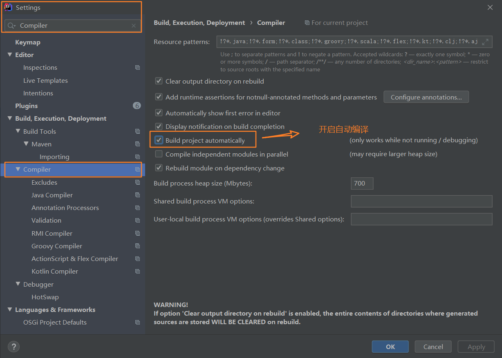
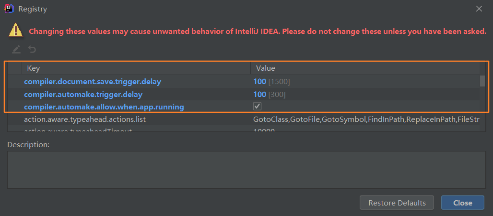
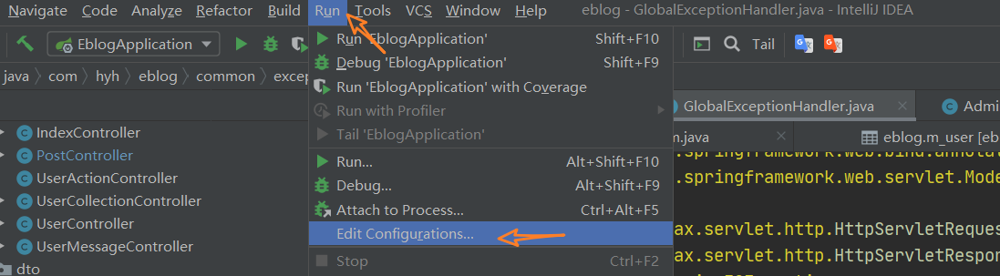
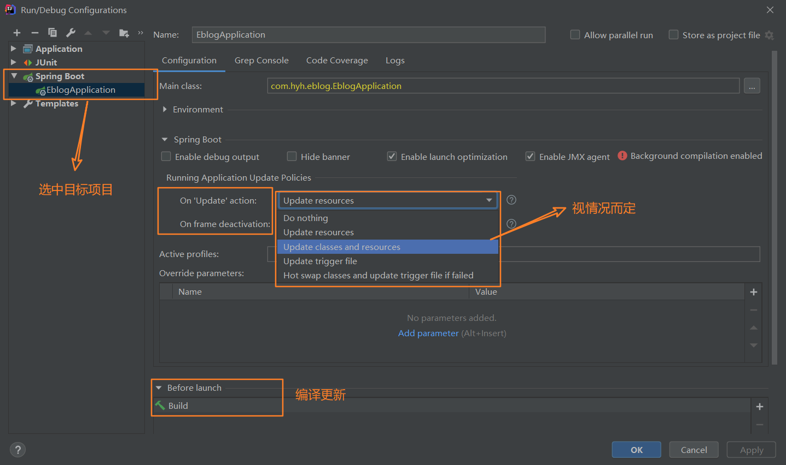
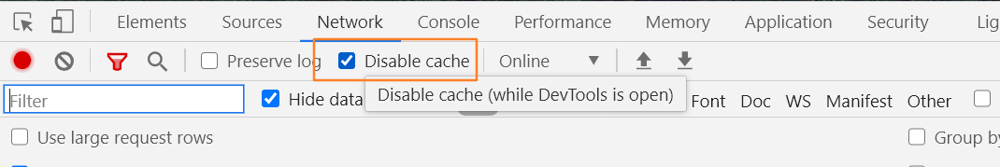

[toc]

# SpringBoot在IDEA中实现热部署

IDEA版本：2020.3

## 具体步骤

### 一、开启IDEA的自动编译【静态】

1. File->Settings。
2. 直接搜索Compiler，选择Build project automatically开启自动编译。



### 二、开启IDEA的自动编译【动态】

1. 同时按住 Ctrl + Shift + Alt + / 然后进入Registry ，勾选自动编译并调整延时参数。
   - compiler.automake.allow.when.app.running -> 自动编译
   - compile.document.save.trigger.delay -> 自动更新文件，针对静态资源，减少delay时间之后，直接按f5刷新即可看到更新后页面。



### 三、开启IDEA的热部署策略【非常重要】

顶部菜单Run- >Edit Configurations->SpringBoot插件->目标项目->勾选热更新。





### 四、在项目添加热部署插件（可选）

> 温馨提示：
>  如果因为旧项目十分臃肿，导致每次都自动热重启很慢而影响开发效率，笔者建议直接在POM移除`spring-boot-devtools`依赖，然后使用Control+Shift+F9进行手工免启动快速更新！！

具体步骤：在POM文件添加热部署插件

```xml
       <dependency>
            <groupId>org.springframework.boot</groupId>
            <artifactId>spring-boot-devtools</artifactId>
            <scope>runtime</scope>
        </dependency>
```

### 五、关闭浏览器缓存（重要）

打开谷歌浏览器，打开F12的Network选项栏，然后勾选【✅】Disable cache 。



### 六、补充

如果使用的Thymleaf，一定记得配置：

```yml
spring:
  thymeleaf:
    cache: false
```

## 参考资料

[IntelliJ IDEA 使用教程(2019图文版) -- 从入门到上瘾](https://www.jianshu.com/p/9c65b7613c30)

[SpringBoot 在IDEA中实现热部署(实用版)](https://www.jianshu.com/p/f658fed35786)