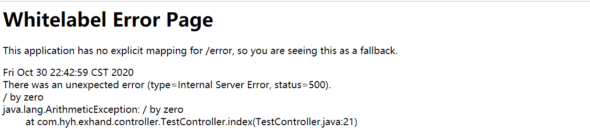
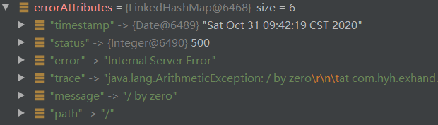

[toc]

# SpringBoot中的全局异常处理

## 本篇要点

- 介绍SpringBoot默认的异常处理机制。
- 如何定义错误页面。
- 如何自定义异常数据。
- 如何自定义视图解析。
- 介绍@ControllerAdvice注解处理异常。

## 一、SpringBoot默认的异常处理机制

默认情况下，SpringBoot为以下两种情况提供了不同的响应方式：

1. Browser Clients浏览器客户端：通常情况下请求头中的Accept会包含text/html，如果未定义/error的请求处理，就会出现如下html页面：Whitelabel Error Page，关于error页面的定制，接下来会详细介绍。



2. Machine Clients机器客户端：Ajax请求，返回ResponseEntity实体json字符串信息。

```json
{
    "timestamp": "2020-10-30T15:01:17.353+00:00",
    "status": 500,
    "error": "Internal Server Error",
    "trace": "java.lang.ArithmeticException: / by zero...",
    "message": "/ by zero",
    "path": "/"
}
```

SpringBoot默认提供了程序出错的结果映射路径/error，这个请求的处理逻辑在BasicErrorController中处理，处理逻辑如下：

```java
// 判断mediaType类型是否为text/html
@RequestMapping(produces = MediaType.TEXT_HTML_VALUE)
public ModelAndView errorHtml(HttpServletRequest request, HttpServletResponse response) {
    HttpStatus status = getStatus(request);
    Map<String, Object> model = Collections
        .unmodifiableMap(getErrorAttributes(request, getErrorAttributeOptions(request, MediaType.TEXT_HTML)));
    response.setStatus(status.value());
    // 创建ModelAndView对象，返回页面
    ModelAndView modelAndView = resolveErrorView(request, response, status, model);
    return (modelAndView != null) ? modelAndView : new ModelAndView("error", model);
}

@RequestMapping
public ResponseEntity<Map<String, Object>> error(HttpServletRequest request) {
    HttpStatus status = getStatus(request);
    if (status == HttpStatus.NO_CONTENT) {
        return new ResponseEntity<>(status);
    }
    Map<String, Object> body = getErrorAttributes(request, getErrorAttributeOptions(request, MediaType.ALL));
    return new ResponseEntity<>(body, status);
}
```

## 二、错误页面的定制

相信Whitelabel Error Pag页面我们经常会遇到，这样体验不是很好，在SpringBoot中可以尝试定制错误页面，定制方式主要分静态和动态两种：

1. **静态异常页面**

在`classpath:/public/error`或`classpath:/static/error`路径下定义相关页面：文件名应为**确切的状态代码**，如404.html，或**系列掩码**，如4xx.html。

举个例子，如果你想匹配404或5开头的所有状态代码到静态的html文件，你的文件目录应该是下面这个样子：

```java
src/
 +- main/
     +- java/
     |   + <source code>
     +- resources/
         +- public/
             +- error/
             |   +- 404.html
    		 |   +- 5xx.html
             +- <other public assets>
```

如果500.html和5xx.html同时生效，那么优先展示500.html页面。

2. **使用模板的动态页面**

放置在`classpath:/templates/error`路径下：这里使用thymeleaf模板举例：

```java
src/
 +- main/
     +- java/
     |   + <source code>
     +- resources/
         +- templates/
             +- error/
             |   +- 5xx.html
             +- <other templates>
```

页面如下：

```html
<!DOCTYPE html>
<html lang="en" xmlns:th="http://www.thymeleaf.org">
    <head>
        <meta charset="UTF-8">
        <title>5xx</title>
    </head>
    <body>
        <h1>5xx</h1>
        <p th:text="'error -->'+ ${error}"></p>
        <p th:text="'status -->' + ${status}"></p>
        <p th:text="'timestamp -->' + ${timestamp}"></p>
        <p th:text="'message -->' + ${message}"></p>
        <p th:text="'path -->' +${path}"></p>
        <p th:text="'trace -->' + ${trace}"></p>
    </body>
</html>
```

> 如果静态页面和动态页面同时存在且都能匹配，SpringBoot对于错误页面的优先展示规则如下：
>
> 如果发生了500错误：
>
> 动态500 -> 静态500 -> 动态5xx -> 静态5xx

## 三、自定义异常数据

默认的数据主要是以下几个，这些数据定义在`org.springframework.boot.web.servlet.error.DefaultErrorAttributes`中，数据的定义在`getErrorAttributes`方法中。



DefaultErrorAttributes类在`org.springframework.boot.autoconfigure.web.servlet.error.ErrorMvcAutoConfiguration`自动配置类中定义：

```java
	@Bean
	@ConditionalOnMissingBean(value = ErrorAttributes.class,
                              search = SearchStrategy.CURRENT)
	public DefaultErrorAttributes errorAttributes() {
		return new DefaultErrorAttributes();
	}
```

**如果我们没有提供ErrorAttributes的实例，SpringBoot默认提供一个DefaultErrorAttributes实例。**

因此，我们就该知道如何去自定义异常数据属性：

1. 实现ErrorAttributes接口。
2. 继承DefaultErrorAttributes，本身已经定义对异常数据的处理，继承更具效率。

定义方式如下：

```java
/**
 * 自定义异常数据
 * @author Summerday
 */
@Slf4j
@Component
public class MyErrorAttributes extends DefaultErrorAttributes {

    @Override
    public Map<String, Object> getErrorAttributes(WebRequest webRequest, ErrorAttributeOptions options) {
        Map<String, Object> map = super.getErrorAttributes(webRequest, options);
        if(map.get("status").equals(500)){
            log.warn("服务器内部异常");
        }
        return map;
    }
}
```

## 四、自定义异常视图

自定义视图的加载逻辑存在于BasicErrorController类的errorHtml方法中，用于返回一个ModelAndView对象，这个方法中，首先通过getErrorAttributes获取到异常数据，然后调用resolveErrorView去创建一个ModelAndView对象，只有创建失败的时候，用户才会看到默认的错误提示页面。

```java
@RequestMapping(produces = MediaType.TEXT_HTML_VALUE)
public ModelAndView errorHtml(HttpServletRequest request, HttpServletResponse response) {
    HttpStatus status = getStatus(request);
    Map<String, Object> model = Collections
        .unmodifiableMap(
        //ErrorAttributes # getErrorAttributes
        getErrorAttributes(request, 
                           getErrorAttributeOptions(request, MediaType.TEXT_HTML)));
    response.setStatus(status.value());
    // E
    ModelAndView modelAndView = resolveErrorView(request, response, status, model);
    return (modelAndView != null) ? modelAndView : new ModelAndView("error", model);
}
```

DefaultErrorViewResolver类的resolveErrorView方法：

```java
@Override
public ModelAndView resolveErrorView(HttpServletRequest request, HttpStatus status, Map<String, Object> model) {
    // 以异常状态码作为视图名去locations路径中去查找页面
    ModelAndView modelAndView = resolve(String.valueOf(status.value()), model);
    // 如果找不到，以4xx，5xx series去查找
    if (modelAndView == null && SERIES_VIEWS.containsKey(status.series())) {
        modelAndView = resolve(SERIES_VIEWS.get(status.series()), model);
    }
    return modelAndView;
}
```

那么如何自定义呢？和自定义异常数据相同，如果我们定义了一个ErrorViewResolver的实例，默认的配置就会失效。

```java

/**
 * 自定义异常视图解析
 * @author Summerday
 */

@Component
public class MyErrorViewResolver extends DefaultErrorViewResolver {

    public MyErrorViewResolver(ApplicationContext applicationContext, ResourceProperties resourceProperties) {
        super(applicationContext, resourceProperties);
    }

    @Override
    public ModelAndView resolveErrorView(HttpServletRequest request, HttpStatus status, Map<String, Object> model) {
        return new ModelAndView("/hyh/resolve",model);
    }
}
```

此时，SpringBoot将会去/hyh目录下寻找resolve.html页面。

## 五、@ControllerAdvice注解处理异常

前后端分离的年代，后端往往需要向前端返回统一格式的json信息，以下为封装的AjaxResult对象：

```java
public class AjaxResult extends HashMap<String, Object> {
    
    //状态码
    public static final String CODE_TAG = "code";
    
    //返回内容
    public static final String MSG_TAG = "msg";
    
    //数据对象
    public static final String DATA_TAG = "data";

    private static final long serialVersionUID = 1L;

    public AjaxResult() {
    }

    public AjaxResult(int code, String msg) {
        super.put(CODE_TAG, code);
        super.put(MSG_TAG, msg);
    }

    public AjaxResult(int code, String msg, Object data) {
        super.put(CODE_TAG, code);
        super.put(MSG_TAG, msg);
        if (data != null) {
            super.put(DATA_TAG, data);
        }
    }

    public static AjaxResult ok() {
        return AjaxResult.ok("操作成功");
    }

    public static AjaxResult ok(Object data) {
        return AjaxResult.ok("操作成功", data);
    }

    public static AjaxResult ok(String msg) {
        return AjaxResult.ok(msg, null);
    }

    public static AjaxResult ok(String msg, Object data) {
        return new AjaxResult(HttpStatus.OK.value(), msg, data);
    }

    public static AjaxResult error() {
        return AjaxResult.error("操作失败");
    }

    public static AjaxResult error(String msg) {
        return AjaxResult.error(msg, null);
    }

    public static AjaxResult error(String msg, Object data) {
        return new AjaxResult(HttpStatus.INTERNAL_SERVER_ERROR.value(), msg, data);
    }

    public static AjaxResult error(int code, String msg) {
        return new AjaxResult(code, msg, null);
    }
}
```

根据业务的需求不同，我们往往也需要自定义异常类，便于维护：

```java
/**
 * 自定义异常
 *
 * @author Summerday
 */
public class CustomException extends RuntimeException {

    private static final long serialVersionUID = 1L;

    private Integer code;

    private final String message;

    public CustomException(String message) {
        this.message = message;
    }

    public CustomException(String message, Integer code) {
        this.message = message;
        this.code = code;
    }

    public CustomException(String message, Throwable e) {
        super(message, e);
        this.message = message;
    }

    @Override
    public String getMessage() {
        return message;
    }

    public Integer getCode() {
        return code;
    }
}
```

@ControllerAdvice和@RestControllerAdvice这俩注解的功能之一，就是做到Controller层面的异常处理，而两者的区别，与@Controller和@RestController差不多。

@ExceptionHandler指定需要处理的异常类，针对自定义异常，如果是ajax请求，返回json信息，如果是普通web请求，返回ModelAndView对象。

```java
/**
 * 全局异常处理器
 * @author Summerday
 */

@RestControllerAdvice
public class GlobalExceptionHandler {

    private static final Logger log = 
        LoggerFactory.getLogger(GlobalExceptionHandler.class);


    @ExceptionHandler(CustomException.class)
    public Object handle(HttpServletRequest request, CustomException e) {
        AjaxResult info = AjaxResult.error(e.getMessage());
        log.error(e.getMessage());
        // 判断是否为ajax请求
        if (isAjaxRequest(request)) {
            return info;
        }
        ModelAndView mv = new ModelAndView();
        mv.setViewName("custom"); // templates/custom.html
        mv.addAllObjects(info);
        mv.addObject("url", request.getRequestURL());
        return mv;
    }

    private boolean isAjaxRequest(HttpServletRequest request) {
        return "XMLHttpRequest".equals(request.getHeader("X-Requested-With"));
    }
}
```

在Controller层，人为定义抛出异常：

```java
@RestController
public class TestController {

    @GetMapping("/ajax")
    public AjaxResult ajax() {
        double alpha = 0.9;
        if (Math.random() < alpha) {
            throw new CustomException("自定义异常!");
        }
        return AjaxResult.ok();
    }
}
```

最后，通过`/templates/custom.html`定义的动态模板页面展示数据：

```html
<!DOCTYPE html>
<html lang="en" xmlns:th="http://www.thymeleaf.org">
    <head>
        <meta charset="UTF-8">
        <title>自定义界面</title>
    </head>
    <body>
        <p th:text="'msg -->'+ ${msg}"></p>
        <p th:text="'code -->'+ ${code}"></p>
        <p th:text="'url -->'+ ${url}"></p>
    </body>
</html>
```

## 源码下载

本文内容均为对优秀博客及官方文档总结而得，原文地址均已在文中参考阅读处标注。最后，文中的代码样例已经全部上传至Gitee：https://gitee.com/tqbx/springboot-samples-learn。

## 参考阅读

- [Spring Boot干货系列：（十三）Spring Boot全局异常处理整理](http://tengj.top/2018/05/16/springboot13/#%E5%89%8D%E8%A8%80)


- [Springboot：Error-handling](https://docs.spring.io/spring-boot/docs/current/reference/html/spring-boot-features.html#boot-features-error-handling)

- [江南一点雨： Spring Boot 中关于自定义异常处理的套路！](http://www.javaboy.org/2019/0417/springboot-exception.html)