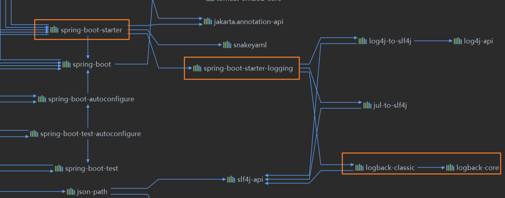

[toc]

# SpringBoot中Logback日志配置解析

## 本篇要点

- 介绍什么是Logback
- 介绍SpringBoot中对logging默认的配置
- 介绍自定义logback-spring.xml的注意点

## 一、Logback日志框架介绍

SpringBoot使用 [Commons Logging](https://commons.apache.org/logging) 进行所有内部日志的记录，但默认配置也提供了对常用日志的支持，如 [Java Util Logging](https://docs.oracle.com/javase/8/docs/api//java/util/logging/package-summary.html)，[Log4J2](https://logging.apache.org/log4j/2.x/)，和[Logback](https://logback.qos.ch/). 每种logger都可以通过配置使用控制台或文件输出日志内容。

[Logback](http://logback.qos.ch/)是log4j框架的作者开发的新一代日志框架，它效率更高、能够适应诸多的运行环境，同时天然支持SLF4J。

## 二、SpringBoot与Logback

假设你使用starter启动创建SpringBoot应用，则默认已经导入了spring-boot-starter-logging的依赖，相继也就导入了logback所需要的依赖。



### 1、默认日志格式

于是，当我们启动SpringBoot应用时，控制台将会显示INFO级别的日志输出。


可以看到，输出内容如下：

- 日期和时间，精确到毫秒级别。
- 日志级别：INFO，【日志级别默认从高到低：ERROR，WARN，INFO，DEBUG，TRACE】。
- 进程ID
- 分隔符：来标识实际日志消息的开始。
- 线程名：用方括号括起来(在控制台输出时可能被截断)。
- 日志记录器名称:这通常是源类名称(通常缩写)。
- 日志信息

> logback是没有FATAL级别的，它对应的就是ERROR。

### 2、控制台输出

默认的日志配置就是将日志信息**显示到控制台**，默认情况下，**将会显示INFO级别以上**的日志信息。你还可以通过使用`--debug`标志启动debug模式。

```shell
$ java -jar myapp.jar --debug
```

使用IDEA操作可以编辑Program arguments：--debug。

在application.properties中配置debug=true同样也可以将日志级别调整到DEBUG。

### 3、文件输出

默认情况下，SpringBoot的日志只会输出到控制台，如果你还想输出到文件中，你需要配置`logging.file.name`和`logging.file.path`两个属性。

下面这个表格展示如何组合使用`logging.*`来达到理想的效果：

| `logging.file.name` | `logging.file.path` | Example    | Description                                                  |
| :------------------ | :------------------ | :--------- | :----------------------------------------------------------- |
| *(none)*            | *(none)*            |            | 只会输出到控制台                                             |
| 指定文件       | *(none)*            | `my.log`   | 写入指定的日志文件在当前项目目录下 |
| *(none)*            | 指定目录  | `log` | 在当前项目下的log目录，写入spring.log文件 |

日志文件达到10 MB时会触发滚动策略【切分】，默认情况下会记录INFO以上级别的信息。 可以使用`logging.file.max-size`属性更改大小限制。 除非已设置`logging.file.max-history`属性，否则默认情况下**将保留最近7天的轮转日志文件**。 可以使用`logging.file.total-size-cap`限制日志归档文件的总大小。 当日志归档的总大小超过该阈值时，将删除备份。 要在应用程序启动时强制清除日志存档，请使用`logging.file.clean-history-on-start`属性。

### 4、日志级别

可以使用logging.level设置所有受支持的日志记录器的级别。

```properties
logging.level.root=warn
logging.level.org.springframework.web=debug
logging.level.org.hibernate=error
```

### 5、日志组

使用logging.group能够将相关的logger组合在一起统一管理日志级别等配置。使用方法如下：

假设定义了group为tomcat：

```properties
logging.group.tomcat=org.apache.catalina, org.apache.coyote, org.apache.tomcat
```

一旦这样定义之后，就可以仅仅通过一行配置，完成相关三个logger的级别配置：

```properties
logging.level.tomcat=TRACE
```

SpringBoot预定义了两个开箱即用的日志组：

| Name | Loggers                                                      |
| :--- | :----------------------------------------------------------- |
| web  | `org.springframework.core.codec`, `org.springframework.http`, `org.springframework.web`, `org.springframework.boot.actuate.endpoint.web`, `org.springframework.boot.web.servlet.ServletContextInitializerBeans` |
| sql  | `org.springframework.jdbc.core`, `org.hibernate.SQL`, `org.jooq.tools.LoggerListener` |

```properties
# pre-defined
logging.level.web=debug
logging.level.sql=debug
```

### 6、自定义log配置

由于日志服务一般都在ApplicationContext创建前就初始化了，它并不是必须通过Spring的配置文件控制。因此通过系统属性和传统的Spring Boot外部配置文件依然可以很好的支持日志控制和管理。

你可以根据你的日志系统，按照下面表格的定义规则，选择定义对应的日志配置：

| Logging System          | Customization                                                |
| :---------------------- | :----------------------------------------------------------- |
| Logback                 | `logback-spring.xml`, `logback-spring.groovy`, `logback.xml`, or `logback.groovy` |
| Log4j2                  | `log4j2-spring.xml` or `log4j2.xml`                          |
| JDK (Java Util Logging) | `logging.properties`                                         |

SpringBoot官方推荐使用带有`-spring`的文件名作为配置，如`logback-spring.xml`而不是`logback.xml`。

这样命名的好处在于：因为标准的`logback.xml`配置文件加载得太早，所以不能在其中使用扩展，需要使用`logback-spring.xml`。

> 当然上面是默认的命名规则，如果你想自定义xml的名称，自定义路径，可以通过logging.config属性配置：`logging.config=classpath:logging-config.xml`

## 三、logback-spring.xml自定义注意事项

接下来分享一份配置十分详细的logback.xml配置，参照注释，应该就能够掌握xml的定义。

```xml
<?xml version="1.0" encoding="UTF-8"?>
<configuration  scan="true" scanPeriod="10 seconds" debug="false">
    <!-- 日志级别从低到高分为TRACE < DEBUG < INFO < WARN < ERROR < FATAL，如果设置为WARN，则低于WARN的信息都不会输出 -->
    <!-- scan:当此属性设置为true时，配置文件如果发生改变，将会被重新加载，默认值为true -->
    <!-- scanPeriod:设置监测配置文件是否有修改的时间间隔，如果没有给出时间单位，默认单位是毫秒。当scan为true时，此属性生效。默认的时间间隔为1分钟。 -->
    <!-- debug:当此属性设置为true时，将打印出logback内部日志信息，实时查看logback运行状态。默认值为false。 -->
    <contextName>logback</contextName>
    <!-- name的值是变量的名称，value的值时变量定义的值。通过定义的值会被插入到logger上下文中。定义变量后，可以使“${}”来使用变量。 -->
    <property name="log.path" value="log" />
    <property name="console_log_pattern"
              value="%black(%contextName-) %red(%d{yyyy-MM-dd HH:mm:ss}) %green([%thread]) %highlight(%-5level) %boldMagenta(%logger{36}) - %gray(%msg%n)"/>
    <property name="charset" value="UTF-8"/>
    <!--输出到控制台-->
    <appender name="console" class="ch.qos.logback.core.ConsoleAppender">
        <!--此日志appender是为开发使用，只配置最底级别，控制台输出的日志级别是大于或等于此级别的日志信息-->
        <!-- 例如：如果此处配置了INFO级别，则后面其他位置即使配置了DEBUG级别的日志，也不会被输出 -->
         <filter class="ch.qos.logback.classic.filter.ThresholdFilter">
             <level>DEBUG</level>
         </filter>
        <encoder>
            <pattern>${console_log_pattern}</pattern>
        </encoder>
    </appender>

    <!--输出到文件,只记录INFO级别信息-->
    <appender name="info_file" class="ch.qos.logback.core.rolling.RollingFileAppender">
        <rollingPolicy class="ch.qos.logback.core.rolling.TimeBasedRollingPolicy">
            <fileNamePattern>${log.path}/roll_info/logback.%d{yyyy-MM-dd}.log</fileNamePattern>
        </rollingPolicy>
        <encoder>
            <pattern>${console_log_pattern}</pattern>
            <charset>${charset}</charset>
        </encoder>
        <!-- 日志记录器的滚动策略，按日期，按大小记录 -->
        <rollingPolicy class="ch.qos.logback.core.rolling.TimeBasedRollingPolicy">
            <!-- 每天日志归档路径以及格式 -->
            <fileNamePattern>${log.path}/info/log-info-%d{yyyy-MM-dd}.%i.log</fileNamePattern>
            <timeBasedFileNamingAndTriggeringPolicy class="ch.qos.logback.core.rolling.SizeAndTimeBasedFNATP">
                <maxFileSize>100MB</maxFileSize>
            </timeBasedFileNamingAndTriggeringPolicy>
            <!--日志文件保留天数-->
            <maxHistory>15</maxHistory>
        </rollingPolicy>
        <!-- 如果超过10MB就删除 -->
        <triggeringPolicy class="ch.qos.logback.core.rolling.SizeBasedTriggeringPolicy">
            <maxFileSize>10MB</maxFileSize>
        </triggeringPolicy>
        <!-- 此日志文件只记录info级别的 -->
        <filter class="ch.qos.logback.classic.filter.LevelFilter">
            <level>INFO</level>
            <onMatch>ACCEPT</onMatch>
            <onMismatch>DENY</onMismatch>
        </filter>
    </appender>
    <!--输出到文件,只记录WARN级别信息-->
    <appender name="warn_file" class="ch.qos.logback.core.rolling.RollingFileAppender">
    </appender>
    <!--输出到文件,只记录ERROR级别信息-->
    <appender name="error_file" class="ch.qos.logback.core.rolling.RollingFileAppender">
    </appender>

    <!--
    root节点是必选节点，用来指定最基础的日志输出级别，只有一个level属性
    level:用来设置打印级别，大小写无关：TRACE, DEBUG, INFO, WARN, ERROR, ALL 和 OFF，默认是DEBUG
    可以包含零个或多个appender元素。
    -->
    <root level="info">
        <appender-ref ref="console" />
        <appender-ref ref="info_file" />
        <appender-ref ref="warn_file"/>
        <appender-ref ref="error_file"/>
    </root>

    <!--
        <logger>用来设置某一个包或者具体的某一个类的日志打印级别、以及指定<appender>。
        <logger>仅有一个name属性，
        一个可选的level和一个可选的additivity属性。
        name:用来指定受此logger约束的某一个包或者具体的某一个类。
        level:用来设置打印级别，大小写无关：TRACE, DEBUG, INFO, WARN, ERROR, ALL 和 OFF，
              如果未设置此属性，那么当前logger将会继承上级的级别。
        additivity:是否向上级logger传递打印信息,默认是true
    -->
    <!-- 使用mybatis的时候，sql语句是debug下才会打印，而这里我们只配置了info，所以想要查看sql语句的话，有以下两种操作：
         第一种把<root level="INFO">改成<root level="DEBUG">这样就会打印sql，不过这样日志那边会出现很多其他消息
         第二种就是单独给mapper下目录配置DEBUG模式，代码如下，这样配置sql语句会打印，其他还是正常DEBUG级别：
    -->
    <logger name="com.hyh.logback.web.LogTestController" level="WARN" additivity="false">
        <appender-ref ref="console"/>
        <appender-ref ref="warn_file"/>
        <appender-ref ref="error_file"/>
    </logger>

    <!--    如果多环境开发可以用springProfile -->
    <!--开发环境:打印控制台-->
    <springProfile name="dev">
        <!--可以输出项目中的debug日志，包括mybatis的sql日志-->
        <logger name="com.hyh.logback.web" level="DEBUG">
            <appender-ref ref="console"/>
        </logger>
        <!--
            root节点是必选节点，用来指定最基础的日志输出级别，只有一个level属性
            level:用来设置打印级别，大小写无关：TRACE, DEBUG, INFO, WARN, ERROR, ALL 和 OFF，默认是DEBUG
            可以包含零个或多个appender元素。
        -->
        <root level="INFO">
            <appender-ref ref="console"/>
        </root>
    </springProfile>
</configuration>
```

最终的效果，会在项目路径下生成日志文件：`/log/info/log-info-2020-11-01.0.log`，并且日志文件的策略也在xml中定义。

控制台打印信息，如下图所示：


## 配置文件下载

本文内容均为对优秀博客及官方文档总结而得，原文地址均已在文中参考阅读处标注。最后，文中的代码及配置文件详细样例已经全部上传至Gitee：https://gitee.com/tqbx/springboot-samples-learn

## 参考阅读

- [嘟嘟：默认日志logback配置解析](http://tengj.top/2017/04/05/springboot7/)

- [SpringBoot官方文档：Log Format](https://docs.spring.io/spring-boot/docs/2.2.7.RELEASE/reference/html/spring-boot-features.html#boot-features-logging-format)

- [Logback官方文档](http://logback.qos.ch/)