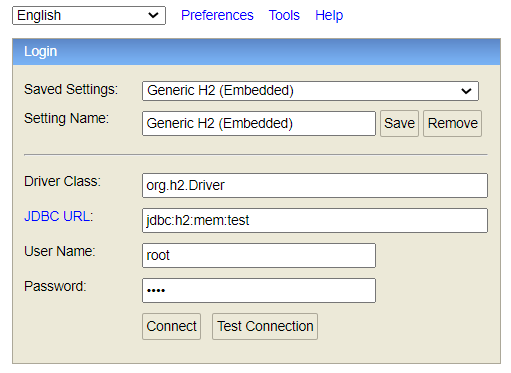

# SpringBoot整合H2内存数据库快速启动测试

参考：[Springboot和内存数据库H2的使用教程](https://www.jdon.com/springboot/spring-boot-and-h2-in-memory-database.html)

## 内存数据库

顾名思义：就是将数据存放载内存中,直接操作的数据库。相对于磁盘，内存的数据读写速度要高出几个数量级，将数据保存在内存中相比从磁盘上访问能够极大地提高应用的性能。优点如下:

- 零项目配置或基础设施
- 易于学习,单元测试

H2就是一款用Java编写的内存数据库之一。

## H2数据库与Springboot的快速整合

1. 添加H2依赖

```xml
        <dependency>
            <groupId>com.h2database</groupId>
            <artifactId>h2</artifactId>
            <scope>runtime</scope>
        </dependency>
```

2. 可以结合持久层的框架,这里采用的mybatis-plus

```xml
        <dependency>
            <groupId>com.baomidou</groupId>
            <artifactId>mybatis-plus-boot-starter</artifactId>
            <version>3.4.0</version>
        </dependency>
```

3. mybatis-plus的相关用法可以参考博客:[MybatisPlus的各种功能使用笔记综合！](https://www.cnblogs.com/summerday152/p/13878187.html)
4. 在适当的位置存放建表的sql。

```java
    schema: classpath:db/schema-h2.sql
    data: classpath:db/data-h2.sql
```

5. 需要的application.yml的配置

```yml
# DataSource Config
spring:
  datasource:
    driver-class-name: org.h2.Driver
    schema: classpath:db/schema-h2.sql
    data: classpath:db/data-h2.sql
    url: jdbc:h2:mem:test
    username: root
    password: test
  h2:
    console:
      enabled: true
# Logger Config
logging:
  level:
    com.hyh.h2.mapper: debug
server:
  port: 8081
```

启动SpringBoot程序,将会自动扫描语句并建立表,填充数据,完成测试操作。

## Springboot和H2数据库管理界面

H2提供了一个名为H2 Console的Web界面来查看数据。让我们在application.properties中启用h2控制台。
需要通过配置开启: `spring.h2.console.enabled=true`

在程序运行过程中,访问:`http://localhost:8081/h2-console/`,这里的端口号,和server.port配置的端口号相同，默认是8080。



配置基本按照yml的就可以成功进入界面，如下：


