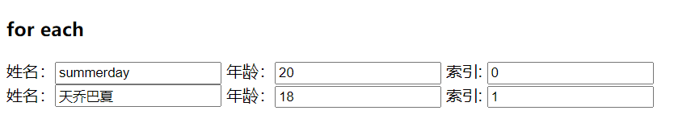

[toc]

# SpringBoot整合Thymeleaf

## 零、本片要点

- 介绍Thymeleaf的概念，理解Thymeleaf的便利且强大。
- 介绍如何快速整合SpringBoot和Thymeleaf。
- 介绍自动配置原理。

## 一、Thymeleaf简介

Thymeleaf是**适用于Web和独立环境的现代服务器端Java模板引擎**，能够处理HTML，XML，JavaScript，CSS甚至纯文本。

Thymeleaf的主要目标是提供一种优雅且高度可维护的模板创建方法。拿Html为例，它**支持html原型**，既可以让美工在浏览器查看页面的静态效果，也可以让开发者填充后端数据。

## 二、快速启动

1. 需要引入thymeleaf需要的依赖，以及必要的web依赖。

```xml
<dependency>
    <groupId>org.springframework.boot</groupId>
    <artifactId>spring-boot-starter-thymeleaf</artifactId>
</dependency>
<dependency>
    <groupId>org.springframework.boot</groupId>
    <artifactId>spring-boot-starter-web</artifactId>
</dependency>
```

2. SpringBoot针对Thymeleaf提供了一套优秀的自动配置方案，这一套配置类的属性在`org.springframework.boot.autoconfigure.thymeleaf.ThymeleafProperties`，部分源码如下：

```java
// 将application.properties前缀为【spring.thymeleaf】的配置和属性绑定
@ConfigurationProperties(prefix = "spring.thymeleaf")
public class ThymeleafProperties {
    //默认的编码格式
	private static final Charset DEFAULT_ENCODING = StandardCharsets.UTF_8;
    //默认视图解析器前缀
	public static final String DEFAULT_PREFIX = "classpath:/templates/";
    //默认视图解析器后缀
	public static final String DEFAULT_SUFFIX = ".html";
	private boolean checkTemplate = true;
	private boolean checkTemplateLocation = true;
	private String prefix = DEFAULT_PREFIX;
	private String suffix = DEFAULT_SUFFIX;
	private String mode = "HTML";
	private Charset encoding = DEFAULT_ENCODING;
	private boolean cache = true;
    //...
```

不难发现，如果开发者不配置前缀和后缀，视图解析的默认位置会在`resources/templates/`目录下，且文件后缀为`.html`。SpringBoot的强大之处就是提供了我们许多配置上的便利，比如，我们可以很容易地关闭Thymeleaf的缓存，在application.properties：

```properties
spring.thymeleaf.cache=false
```

SpringBoot为Thymeleaf提供的自动化配置类是：

```java
@Configuration(proxyBeanMethods = false)
@EnableConfigurationProperties(ThymeleafProperties.class)
@ConditionalOnClass({ TemplateMode.class, SpringTemplateEngine.class })
@AutoConfigureAfter({ WebMvcAutoConfiguration.class, WebFluxAutoConfiguration.class })
public class ThymeleafAutoConfiguration {
    
}
```

可以看到，这个配置类首先**导入了ThymeleafProperties配置类**，然后通过@ConditionalOnClass注解标识这个类**只有系统中存在TemplateMode和SpringTemplateEngine的时候才会生效**，其实也就是引入了Thymeleaf相关依赖就会生效。

3. 创建测试Controller

```java
@Controller
public class HelloController {

    @GetMapping("/")
    public String index(ModelMap map){
        map.addAttribute("url","/list");
        map.addAttribute("msg","点我点我");
        return "index";
    }
}
@GetMapping("/list")
public String list(Model model){
    List<User> users = new ArrayList<>();
    users.add(new User(UUID.randomUUID().toString(),"summerday",20));
    users.add(new User(UUID.randomUUID().toString(),"天乔巴夏",18));
    model.addAttribute("users",users);
    return "list";
}
```

由于我们并没有修改过视图解析的配置，我们需要在/resources/templates/提供名为index.html和list.html的文件。

4. 编写Thymeleaf模板

```html
<!--index.html-->
<!DOCTYPE html>
<!--suppress ALL-->
<html xmlns:th="http://www.thymeleaf.org">
    <head>
        <meta charset="UTF-8">
        <title>Hello</title>
    </head>
    <body>
       <!-- thymeleaf通过th标签增强属性,最终通过标签中的内容覆盖原有标签内容-->
       <a href="http://www.hyhwky.com" th:href="${url}"><p th:text="${msg}"></p> </a>
    </body>
</html>

<!--list.html-->
<!DOCTYPE html>
<!--suppress ALL-->
<html xmlns:th="http://www.thymeleaf.org">
    <head>
        <meta charset="UTF-8">
        <title>list</title>
    </head>
    <body>
        <h3>for each</h3>
        <!--说明： th:each="obj,stat:${objects}" 分别代表单个实例,状态(可省略),待遍历对象-->
        <div th:each="user,stat:${users}">
            <input type="hidden" name="id" th:value="${user.id}"/>
            姓名：<input type="text" name="username" th:value="${user.username}"/>
            年龄：<input type="text" name="age" th:value="${user.age}"/>
            索引: <input type="text" th:value="${stat.index}">
        </div>
    </body>
</html>
```

list页面渲染结果如下：



除此之外，Thymeleaf还支持使用js获取Model中的变量：

```js
    <script th:inline="javascript">
		var msg = [[${msg}]];
		console.log(msg)
    </script>
```

## 三、源码下载

本文主要介绍了SpringBoot整合Thymeleaf自动配置的原理，以及快速启动demo项目需要的步骤。关于Thymeleaf本身，还有其他许多强大的用法，可以参照官方文档，一一测试：https://www.thymeleaf.org/doc/tutorials/3.0/usingthymeleaf.html

另外，本文的样例代码【包括其他基础标签的使用】均已上传至Gitee：https://gitee.com/tqbx/springboot-samples-learn

## 四、参考阅读

- [江南一点雨：极简 Spring Boot 整合 Thymeleaf 页面模板](http://www.javaboy.org/2019/0613/springboot-thymeleaf.html)
- [官方文档：Tutorial:Using Thymeleaf](https://www.thymeleaf.org/doc/tutorials/3.0/usingthymeleaf.html)

- [纯洁的微笑：Thymeleaf 使用详解](http://www.ityouknow.com/springboot/2016/05/01/spring-boot-thymeleaf.html)
- [yizhiwazi：SpringBoot Thymeleaf 基于HTML5的现代模板引擎](https://www.jianshu.com/p/8dc48fa74e7e)